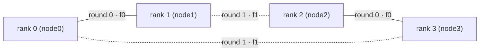

# SparkRing Architecture

SparkRing is a low-latency collective transport and inference-runtime stack for
**switchless, directly cabled NVIDIA DGX Spark (GB10) clusters**. Four Sparks are
joined into a 200 Gbit/s cycle with plain DAC cables — no switch — and a custom
RoCE transport drives the hot decode collectives of GLM-5.2 under vLLM, with a
patched NCCL as the attested fallback lane for everything else.

This document explains how the pieces fit. File paths are relative to the
repository root so you can jump straight to code.

---

## 1. Physical topology: a 4-cycle that is two perfect matchings

Each DGX Spark runs confirmed dual-port ConnectX-7 operation: cage 0 is
netdev `enp1s0f0np0` / RDMA device `rocep1s0f0`, cage 1 is `enp1s0f1np1` /
`rocep1s0f1`. Four QSFP28 DACs connect the nodes in a ring — one direct
200 Gb/s link per ring edge — and every cable joins the **same cage index on
both ends**:



Ring order is `0 → 1 → 2 → 3 → 0`. The edge set of this 4-cycle decomposes into
exactly two perfect matchings, and the cabling maps each matching onto its own
NIC port:

```text
round 0 / cage 0 / rocep1s0f0:   0 <-> 1    and    2 <-> 3
round 1 / cage 1 / rocep1s0f1:   0 <-> 3    and    1 <-> 2
```

**Why two rounds complete an all-reduce.** This is recursive doubling on four
ranks (`log2(4) = 2` steps). After round 0, ranks 0 and 1 each hold
`sum(0,1)` and ranks 2 and 3 each hold `sum(2,3)`. In round 1 every rank
exchanges its partial with a partner from the *other* pair (0↔3, 1↔2), so every
rank ends with the full four-way sum. Because each round lives on a dedicated
physical port, both matchings run simultaneously at full 200G with zero
contention — a four-rank all-reduce costs exactly two link traversals. The
measured ordinary-CUDA-tensor TP4 all-reduce is 40.14–40.22 µs p50
(50.11–50.85 µs p99, 10,000 iterations, zero mismatches on all four ranks)
for the hot GLM decode shape (`spark_transport/README.md`, "TP4 status and open work";
implementation: `spark_transport/src/tp4_schedule.cpp`,
`spark_transport/src/tp4_session.cpp`).

Addressing: one dedicated point-to-point **/24 per physical link** (four
distinct RFC1918 /24s — `<SUBNET_01>.0/24`, `<SUBNET_12>.0/24`,
`<SUBNET_23>.0/24`, `<SUBNET_30>.0/24`, the placeholder names used in
`docs/SETUP.md`), MTU 9000,
**GID index 3 (IPv4 RoCEv2)**. Link-local RoCEv1 GIDs are proven wrong on this
topology. Management traffic (SSH, NCCL bootstrap, the API endpoint on
`http://<HEAD_MGMT_IP>:8210`) stays on a separate management network; fabric
payloads appear only on the RoCE devices. Every edge is qualified before model
work with the non-destructive runner in
`spark_transport/CABLE_QUALIFICATION.md`.

---

## 2. The GB10 constraint — and the hardware quirk the whole project rides on

GB10 has **no working GPUDirect RDMA**: `ibv_reg_mr()` fails on both
`cudaMalloc` and `cudaMallocManaged` allocations on every Spark tested
(`spark_transport/README.md`, "Persistent GPU doorbell results"). On a
discrete-GPU system that would kill a GPU-driven RDMA transport — you would be
staging through host DRAM over PCIe.

But GB10 is a Grace-Blackwell superchip with **coherent unified LPDDR5X
memory**: CPU and GPU share one physical memory. A `cudaHostAllocMapped`
arena is therefore simultaneously

- registrable with `ibv_reg_mr()` (it is host memory as far as verbs cares),
- writable and readable by the GPU at effectively local-memory cost (no PCIe
  hop exists), and
- honest about ordering: the platform supports host-native atomics
  (`cudaDevAttrHostNativeAtomicSupported`) and `__threadfence_system()` is
  visible to the CPU and NIC.

Measured consequence: a 16 KB RDMA write into a registered mapped arena runs at
4.5 µs p50 with GPU producer and GPU verifier — indistinguishable from
page-aligned host memory — and, on the TP2 integration-faithful 12 KB staging
path, copying an ordinary `cudaMalloc` tensor into the mapped send arena adds
**less than 1 µs** at p50 (`spark_transport/README.md`, "TP2 BF16 exchange
and fused add"). So the "missing" GPUDirect
path is replaced by registered mapped arenas at near-zero cost. This single
hardware quirk is the key insight of the project: it makes a GPU-driven,
switchless RDMA transport possible on hardware that nominally does not support
one.

---

## 3. SIRCL transport core (`spark_transport/`)

SIRCL is the **Switchless Inference RDMA Collective Layer** inside SparkRing,
not a separate service or an NCCL fork. SparkRing is the full inference stack;
SIRCL is the direct-cable collective runtime described in this section. See
[`SIRCL.md`](SIRCL.md) for its public boundary and implemented-versus-planned
surface.

The core abstractions (`spark_transport/README.md`):

- **`VerbsEndpoint`** — one RC QP + MR per directed peer edge
  (`spark_transport/src/verbs_endpoint.cpp`). There is no global QP or global
  memory region; a four-rank process creates one endpoint per local edge, which
  is what lets both CX-7 ports operate independently.
- **`MemoryBuffer` arenas** — swappable host / CUDA-mapped / write-combined
  storage (`spark_transport/src/memory_buffer.cu`). Persistent registered
  `cudaHostAllocMapped` arenas hold ingress slots and staging space for the
  session lifetime; tensors in ordinary CUDA memory are staged in and fused out
  by GPU kernels.
- **GPU doorbells with system-scope fences**
  (`spark_transport/src/gpu_doorbell.cu`, `spark_transport/src/gpu_tp4_tensor.cu`).
  The producer GPU writes payload then a sequence doorbell with ordered RC
  writes; the consumer GPU busy-waits on the doorbell, consumes, and the
  protocol acknowledges over RC before a slot is reused.
- **Sequence/ack protocol** — every collective claims a monotonically
  increasing sequence; peers exchange payload + sequence, then acknowledgement.
  A slot is never overwritten before its consumption is acknowledged
  (`spark_transport/src/tp4_session.cpp`,
  `spark_transport/src/tp4_allgather_session.cpp`,
  `spark_transport/src/tp4_dcp_session.cpp`,
  `spark_transport/src/tp4_vocab_allgather_session.cpp`).
- **Bounded in-flight window** — submissions flow through a bounded queue
  (deployment default `SPARK_TP4_MAX_INFLIGHT=64`); a full window backpressures
  the producer instead of dropping or reordering.
- **Event gate pool** (`spark_transport/src/cuda_event_gate.hpp`,
  `spark_transport/src/cuda_stream_handoff.hpp`) — reusable CUDA events gate
  the consuming stream on native completion so the Python submission path stays
  asynchronous. This is also why failure policy is strict: once an event wait
  is enqueued on the stream, an in-process fallback to NCCL is unsafe, so any
  native failure after enqueue terminates the worker (fail-closed by design).

CPU affinity is a deployment requirement, not a tweak: in the TP2
measurements, pinning removed roughly 7 µs of p99 host-polling and
acknowledgement jitter (`spark_transport/README.md`, "TP2 BF16 exchange and
fused add"); the in-tree four-rank probe runners pin TP submission and
progress work to dedicated cores (CPUs 10/11).

Numerics: the GLM checkpoint quantizes weights (MXFP4 experts, FP8 attention),
but the TP partial-sum path stays **BF16** — weight quantization does not make
packed NVFP4 a valid all-reduce format. NVFP4 CKV movement is a raw-copy
transport with scale metadata, never a reduction.

---

## 4. CUDA-graph story: device-published command rings

A captured CUDA graph replays only kernels — Python adapters, the C API, host
sequence increments, and progress-thread wakeups do not run again. Naively
capturing the eager path would freeze one sequence number into the graph and
replay it forever (the full blocker analysis is
`spark_transport/integrations/vllm/TP4_CUDAGRAPH_READINESS.md`).

SparkRing's answer is to move submission *into* the captured kernel via a
64-slot `cudaHostAllocMapped` command ring
(`spark_transport/src/tp4_graph_command.cpp`, design and gates in
`spark_transport/GRAPH_NATIVE_TP4_Q1.md`):

```text
captured GPU kernel (per collective node)
  -> system-scope CAS reserves ring capacity, claims the next sequence
  -> writes {sequence, trace, q, payload_bytes} into its mapped slot
  -> __threadfence_system(), then publishes in exact sequence order
  -> drives round-0/round-1 doorbells with its claimed sequence

persistent progress thread (pinned, lock-free in graph mode)
  -> busy-polls the producer cache line (adaptive spin/yield)
  -> consumes descriptors, runs the two-round verbs submission/completion
  -> advances the completed sequence on a separate consumer cache line
```

Replay is nothing but `cudaGraphLaunch` — no host callback, CUDA API call,
allocation, or lock on the replay path. GPU-owned claim/publish counters and
CPU-owned consume/complete counters live on separate cache lines; a claim is
allowed only while fewer than 64 sequences are outstanding, so a live slot can
never be overwritten. Overflow or publication regression is process-fatal.

Measured on the live four-rank cluster: **~1.9 µs host submit** per replayed
graph and ~39.1 µs device time per Q1 all-reduce — slightly below the
40.14–40.22 µs p50 eager ordinary-CUDA-tensor all-reduce
(`spark_transport/README.md`) — validated through 10,000 replays with exact
published = consumed = completed sequences and zero mismatches, and through a
128-nodes-per-graph soak (13,056 published/consumed/completed sequences per
rank, zero overflow, zero mismatches; `spark_transport/GRAPH_NATIVE_TP4_Q1.md`). One
Q5-capacity session serves all of Q1–Q5; each captured node carries its fixed
`q` in the descriptor. Sessions are intentionally process-lifetime, one stable
capture stream is enforced, and capture never opens sockets or allocates —
a not-yet-ready capture records the original collective instead.

---

## 5. vLLM integration: a fail-closed overlay

SparkRing never forks or rebuilds vLLM. Code enters each container two ways
(`spark_transport/integrations/vllm/README.md`):

1. **Read-only mounts** — the SHA-256-manifested source bundle at
   `/opt/spark-vllm:ro` (first on `PYTHONPATH`, so
   `spark_transport/integrations/vllm/sitecustomize.py` installs the adapters
   before vLLM imports), plus `libspark_transport_capi.so` and the patched
   NCCL, both checksum-pinned and mounted read-only.
2. **In-place source patching at container start** — the serve entrypoint's
   `replace_once` patcher edits the installed vLLM (shared capture stream,
   capture-size synthesis, B12X DCP1 logical→physical top-k remap, dispatcher
   guards). Every patch **attests the SHA-256 of the upstream function it
   replaces**: patches are idempotent and refuse unexpected source, so a vLLM
   upgrade fails loudly at startup instead of silently mispatching. The
   orchestrator (`scripts/run-glm52-graph-window.ps1`) then re-attests the
   full command line, environment, image ID, and library checksums on every
   rank before traffic.

**Interception is by exact signature; everything else falls back to stock.**
Each adapter admits only measured tensor signatures (world size 4, contiguous
CUDA, exact shape/dtype/stride); any other collective flows through the
original vLLM/NCCL dispatch unchanged. The fallback is *audited*, not assumed:
a flight recorder (`spark_transport/integrations/vllm/spark_tp4_flight_recorder.py`,
`spark_collective_audit.py`, `spark_dcp_collective_audit.py`) counts every
stock call, and the decode-transport audit confirms zero stock fallback in
steady-state decode (Q1–Q40).

The collective family taxonomy:

| Family | Patched call | Admitted signature | Backend file |
|---|---|---|---|
| TP all-reduce | `CudaCommunicator.all_reduce` | BF16 `[Q,6144]`, Q1–Q40 (Q512 prefill opt-in) | `integrations/vllm/spark_tp4_backend.py` |
| Generic all-gather | `PyNcclCommunicator.all_gather` | indexer `[Q,2,2048]` INT32; CKV UINT8 shapes (fenced) | `integrations/vllm/spark_tp4_allgather_backend.py` |
| Vocabulary all-gather | `GroupCoordinator._all_gather_out_place` | BF16 `[Q,38720]` → token-major `[Q,154880]` | `integrations/vllm/spark_tp4_vocab_allgather_backend.py` |
| DCP query all-gather | `GroupCoordinator._all_gather_out_place` (group `dcp:0`) | BF16 `[Q,16,576]` → `[Q,64,576]` | `integrations/vllm/spark_tp4_dcp_backend.py` |
| DCP fused combine | `cp_lse_ag_out_rs` | latent-512 online-softmax combine (replaces LSE all-gather + output reduce-scatter) | `integrations/vllm/spark_tp4_dcp_backend.py` |
| DCP owner top-k all-gather | — (stays stock) | graph-capture-unsupported by design; runs on the attested NCCL lane | — |

Every family goes through the same lifecycle: **shadow** (run both paths,
return the stock result, compare byte-exact or within declared tolerances) →
per-signature **promotion** to custom → optional **graph capture**. Native
failure before enqueue falls back cleanly; after enqueue it terminates the
worker. The graph census is window-scoped. In the 2026-07-27 DCP4 switchless
window the rank-consistent census was 6,744 custom all-reduce and 24 custom
vocabulary captures, with 2,904 attested stock captures per rank: the three
DCP collective families that [RESULTS.md](RESULTS.md) records as the
attested stock captures. In the
2026-07-28 measurement window labelled `v40`, where DCP query and combine ran
on the custom path, the census was 5,464 custom
all-reduce + 24 custom vocabulary captures, and each rank additionally
captured 1,272 custom DCP query and 1,272 custom combine nodes, leaving 360
stock `dcp_owner_topk_all_gather` nodes per rank as the only stock captures —
attested, by design.

---

## 6. Serving configuration: the TP4/DCP4 lane

The production GLM-5.2 lane as of the v40 window (2026-07-28), launched via
the maintainer-held reference launcher and serving entrypoint, which are not
included in this repository:

- **TP4 / DCP4** — `--tensor-parallel-size 4 --decode-context-parallel-size 4
  --dcp-comm-backend ag_rs`, B12X sparse-MLA attention backend.
- **Adaptive MTP2/4** — MTP speculative decoding with depths `{2,4}` over a
  32-round window (`VLLM_ADAPTIVE_SPEC_DEPTHS=2,4`); Q cap 40
  (= 8 max seqs × (4 draft + 1) rows).
- **Per-token `nvfp4_ds_mla` KV** — `--kv-cache-dtype nvfp4_ds_mla` with
  per-token scales (`VLLM_NVFP4_MLA_PER_TOKEN_SCALE=1`). v40 window config
  (2026-07-28): KV 4,000,000,000 bytes/rank, max model length 458,752. The
  2026-07-27 DCP4 switchless window instead ran 3,000,000,000
  bytes/rank with max model length 65,536.
- **FULL_AND_PIECEWISE CUDA graphs** through Q40, capture sizes attested at
  launch and serve.

**Why DCP4 quadruples KV capacity.** MLA's latent KV cache is shared by all
attention heads, so tensor parallelism cannot shard it — under TP4/DCP1 every
rank stores a full replica of every sequence's KV. DCP4 instead shards each
context's tokens across the four ranks (each rank owns ~¼ of the KV, with the
query all-gather / owner-top-k / combine collectives of §5 reassembling
attention), turning four replicas into four shards: ~4× aggregate KV capacity
for the same per-rank bytes. Reported KV capacity is window-specific: the
2026-07-27 DCP4 switchless window measured a 375,040-token pool at
3.0 GB/rank; the v40 window (2026-07-28) reports a 500,224-logical-token pool
at 4 GB/rank. The sealed C1 sustained-decode cell ran in the v40 window on
the 4 GB/rank, 500,224-token config: 20.83 / 19.28 / 21.43 tok/s at
8K / 16K / 32K context.

---

## 7. Patched NCCL: the attested fallback lane

Stock NCCL cannot even initialize on this fabric: at init it builds Tree/PAT
channels between *all* rank pairs, and the non-adjacent pairs (0–2, 1–3) have
no L2 adjacency on a switchless ring, so RoCEv2 CM fails. Two patches on pinned
NCCL v2.30.7 fix this
(`spark_transport/experiments/nccl_switchless_ring/`):

1. `nccl-2.30.7-skip-tree-pat.patch` — never create Tree/PAT connections;
   ring-feasible neighbor pairs only (`NCCL_SKIP_TREE_CONNECT=1`).
2. `nccl-2.30.7-advertise-all-listener-gids.patch` — the listener advertises
   the GIDs of both local RoCE devices so subnet-aware routing
   (`NCCL_IB_SUBNET_AWARE_ROUTING=1`, `NCCL_IB_SUBNET_PREFIX_LEN=24`) picks the
   device whose /24 contains the peer. No packet ever transits an intermediate
   Spark — this is why the per-link /24 addressing of §1 is load-bearing.

The library is `LD_PRELOAD`ed from a read-only, SHA-256-pinned mount, and the
orchestrator attests the mount, checksum, and NCCL environment on every rank
(`NCCL_ALGO=Ring`, `NCCL_IB_HCA=rocep1s0f0,rocep1s0f1`, GID 3; bootstrap on
the management NIC only). Its role is deliberate: it is the **attested
fallback lane** that carries everything the custom transport does not admit —
prompt-prefill shapes, DCP owner top-k, cell transitions, and any future
unsupported signature — over the same direct cables, ring-only, with NET/IB on
the data path. Model-down probes
(`spark_transport/experiments/nccl_switchless_ring/probe_dcp4_collectives.py`)
validate exact values and rank-major layout for every communicator scope vLLM
will create before a single model process starts.

---

## Reading map

| Topic | Where |
|---|---|
| Transport core, doorbell/TP2/TP4 results | `spark_transport/README.md` |
| Graph-native design, replay state machine, gates | `spark_transport/GRAPH_NATIVE_TP4_Q1.md` |
| Why eager capture fails; readiness contract | `spark_transport/integrations/vllm/TP4_CUDAGRAPH_READINESS.md` |
| Adapter env flags, shadow/promotion, taxonomy | `spark_transport/integrations/vllm/README.md` |
| Cable/edge qualification | `spark_transport/CABLE_QUALIFICATION.md` |
| Switchless NCCL patches and probes | `spark_transport/experiments/nccl_switchless_ring/` |
| Orchestration, attestation, live gates | `scripts/run-glm52-graph-window.ps1`, `scripts/validate_glm52_graph_live.py` |
| Results and open work | [Project overview](../README.md), [component status](STATUS.json), and [measured results](RESULTS.md) |
