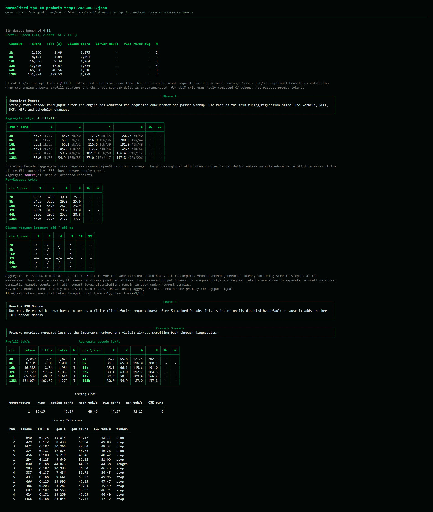

# SparkRing results

This page lists results for the supported DGX Spark profiles. Each number only
applies to the model, settings, hardware, and topology stated with it.

## GLM-5.2 EXL3 3.5-bpw

**Status: candidate at 1,048,576 tokens and 16 sequences. The older
262,144-token, eight-sequence setup remains qualified on one appliance.**
The serving contract is [the fixed-MTP4 profile](GLM52_35BPW_FIXED_MTP4_PROFILE.md): TP4/DCP4,
fixed MTP4, `nvfp4_ds_mla` key-value cache with 9.25 GB per rank, bounded
full-CKV gather, and SIRCL TP collectives with patched NCCL fallback.

This first table shows the older 262,144-token, eight-sequence setup. It does
not describe the new settings:

| Context | 4K | 8K | 16K | 32K | 64K | 128K |
|---|---:|---:|---:|---:|---:|---:|
| Prefill, tokens/s | — | 679 | 673 | 666 | 657 | 645 |
| Decode, one stream | 22.6 | 22.0 | 21.3 | 20.4 | 21.4 | — |
| Decode, four streams | 50.3 | 51.9 | 49.2 | 45.6 | 47.2 | — |
| Decode, eight streams | 78.4 | 71.3 | 70.0 | 65.5 | 67.8 | — |

Coding prompts reached 27.3 tokens/s single-stream with 96.64% measured draft
acceptance. The matched C8 cell regressed 11.63% under MTP4. A rebuilt image
has no acceptance status until it completes
[the full acceptance checklist](GLM52_35BPW_PROMOTION_CHECKLIST.md). The figures
above belong to qualified operator image
`sha256:02881d5229d4f4d1cbba0cf40537492a2a505b9d4e43bbfe9a0b2a7bd0584513`;
they do not transfer to rebuilt image
`sha256:5569c4778c9561a8595ac283c7adf31e22be1d35517aa208569af5224244a2da`,
whose separate scope is recorded in
[`rebuilt-image-20260821.md`](../performance/records/glm-3.5bpw/rebuilt-image-20260821.md).

One rebuilt image has been carried from a clean checkout to a serving
endpoint on four ranks, with its checkpoint, generated profiles, and in-image
runtime bytes verified against their pinned identities. That record reports
no throughput figure and does not promote the profile. See
[the rebuilt-image bring-up record](../performance/records/glm-3.5bpw/rebuilt-image-20260821.md).

The new 1,048,576-token, 16-sequence setup started successfully. At temperature
1.0 and top-p 0.95, prefill measured 694 tok/s at 2K down to 635 tok/s at 128K.
Decode is complete through C8 from 2K to 32K, plus 64K/C1. The remaining
long-context coordinates are pending. See
the [full benchmark record](../performance/records/glm-3.5bpw/normalized-base-20260822.md).
Its fresh-namespace launch also exposed a create-once exact-Q40 receipt
restartability limitation; no receipt was deleted or overwritten.

## DeepSeek-V4-Flash-0731

**Status: live-benchmarked base settings.** Two-Spark-pair and
four-Spark-cycle launches exercised API health, chat completions, tool calling,
and DSpark speculative decoding using the immutable image pinned by
[`runtime/faststart-lock.json`](../runtime/faststart-lock.json). Both use
`fp8_ds_mla` for the MLA key-value cache and a 1,048,576-token request limit.
The base settings reserve 17,179,869,184 bytes per rank, use a
4,096-token scheduler budget, and set block size 256 in both topologies.

The pair used `DeepSeek-V4-Flash-DSpark@913f0657…`; the cycle used the plain
`DeepSeek-V4-Flash-0731@7872f01…`. Their configuration, tokenizer
configuration, and tensor index match, while all 48 weight payload identifiers
differ. The results therefore describe two explicit serving profiles rather
than an exact same-weight topology scaling experiment.

The two-Spark and four-Spark base setups were benchmarked through 128K prefill
and every concurrency/context combination that fit their KV pools at
temperature 1.0 and effective top-p 1.0. C1/C2 use at least five accepted
observations per context; other applicable cells use at least three. At 16K,
the pair measured 307.13 aggregate tok/s at C32 and the cycle measured 508.11.
Repeated cells retain substantial DSpark-acceptance variance. See the
[full TP2 record](../performance/records/deepseek-v4-flash/normalized-tp2-base-temp1-n5-20260823.md)
and [full TP4 record](../performance/records/deepseek-v4-flash/normalized-tp4-base-temp1-n5-20260823.md).

The public tree retains functional SparkCache launcher and restore validation,
but does not publish performance tables from other sampling temperatures. The
normalized SparkCache profiles still require temperature-1 remeasurement.

A research-only width-4096 SIRCL candidate completed four-rank CUDA graph
capture and API smoke while every rank's native published, consumed, and
completed counters remained equal and overflow remained zero. A matched
temperature-1 research A/B found no performance advantage for the SIRCL
path. Prefill was flat because both arms use NCCL there. Five-run Coding Peak
was 1.9% lower by mean under SIRCL. Long C32 rates were dominated by DSpark
acceptance variation, but repeated near-matched ten-second samples placed SIRCL
2.4-3.0% below NCCL. See the
[transport A/B record](../performance/records/deepseek-v4-flash/sircl-width4096-nccl-ab-20260822.md).
The consolidated findings page is
[DeepSeek-V4 SIRCL Findings](DEEPSEEK_V4_SIRCL_FINDINGS.md).

## Qwen3.8-27B EXL3 K5/K6

Both tested profiles use a 1,048,576-token static-YaRN limit, an 8,192-token
scheduler budget, FP8 KV, probabilistic Qwen MTP3 with standard rejection,
native prefix caching, full-decode CUDA graphs, and patched NCCL. Benchmark
requests used temperature 1.0; the pinned model config supplied effective
top-p 0.95 and top-k 20.

### Two Sparks — TP2/DCP1

Prefill measured 1,274–1,401 tok/s through 32K, 1,050 at 64K, and 785 at
128K. Sustained decode measured 25–30 tok/s at C1, 41–54 at C2, 72–100 at C4,
and 90–154 aggregate tok/s at C8. Coding Peak completed 15/15 requests with a
39.95 tok/s mean. See the [full two-Spark result](../performance/records/qwen38-27b/normalized-tp2-1m-probmtp-temp1-20260823.md).

### Four Sparks — TP4/DCP1

Prefill measured 1,855–2,001 tok/s through 32K, 1,616 at 64K, and 1,279 at
128K. Sustained decode measured 30–36 tok/s at C1, 55–66 at C2, 87–121 at C4,
and 138–202 aggregate tok/s at C8. Coding Peak completed 15/15 requests with a
48.46 tok/s mean. See the [full four-Spark result](../performance/records/qwen38-27b/normalized-tp4-1m-probmtp-temp1-20260823.md).

N is shown in each full result table. C16 and C32 were not run and are shown as
dashes rather than zero throughput.

## Interpretation

Do not compare these values across model identities or use them as a generic
hardware benchmark. The GLM result is acceptance evidence for one appliance;
the DeepSeek observations establish functional serving only.
