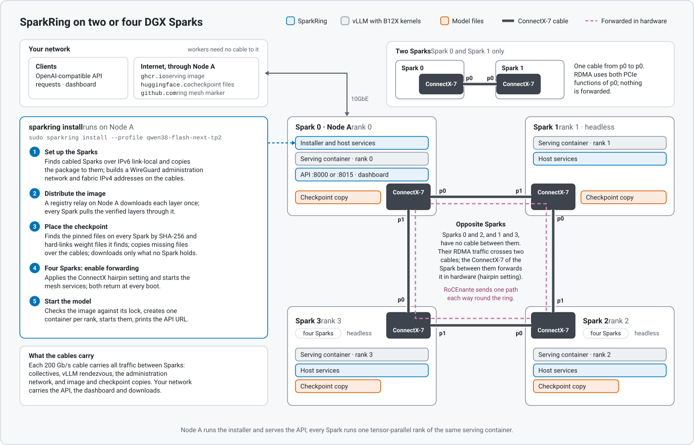
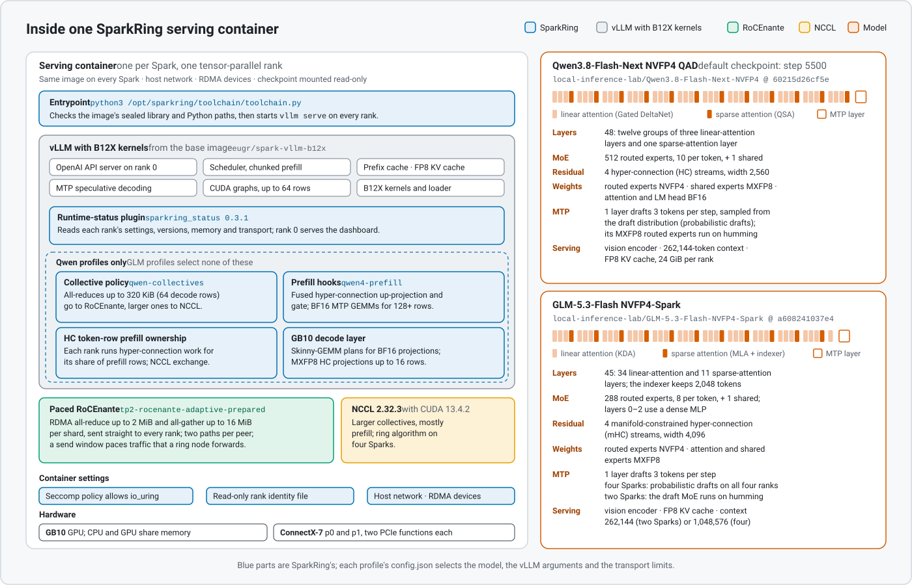
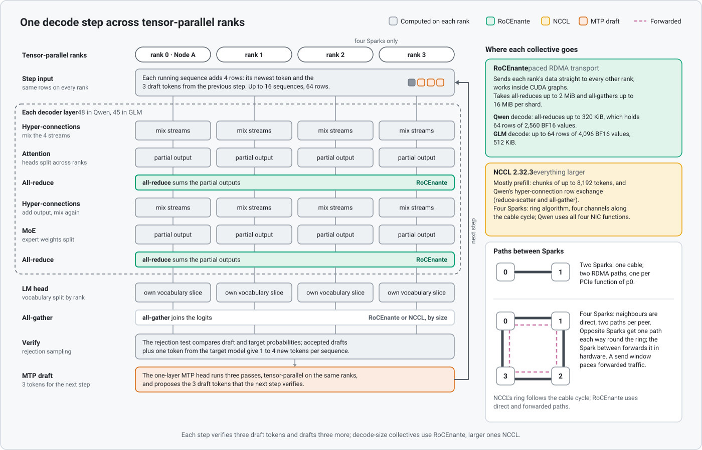

# SparkRing architecture

SparkRing runs one model across two or four DGX Sparks that are cabled directly
to each other, with no switch. Every Spark runs the same container image. Rank 0
is Node A, where you run the installer; it also serves the OpenAI-compatible API. The
[README](../../README.md#profiles) lists the profiles that `sparkring install`
sets up; the [profile catalog](../../profiles/README.md) lists every profile.

## Topology

A four-Spark ring is cabled as the cycle `0-1-2-3-0`, so each Spark has two
neighbors: rank 0 connects to ranks 1 and 3, rank 1 to ranks 0 and 2, and so
on. Traffic between Sparks that are not neighbors (0 and 2, 1 and 3) passes
through a neighbor's ConnectX card, which forwards it in hardware. That needs
the ConnectX [hairpin setting](../operations/install.md#four-spark-rings),
which `sparkring install` applies and repeats at every boot.

A pair uses ranks 0 and 1 and one cable from p0 to p0, so no traffic is
forwarded.

With `sparkring install`, only Node A needs your network: it serves the API
and the dashboard and downloads the image and checkpoint for every Spark.
Everything between Sparks runs over the cables: collectives, vLLM's startup
rendezvous at rank 0's fabric address, the administration network (WireGuard
over the cables' IPv6 link-local addresses) that carries SSH and image layers,
and checkpoint copies, which go straight between the fabric addresses at the
two ends of a cable.

## Serving container

Every Spark runs one container of the same image, one tensor-parallel rank.
Each profile's `profiles/<id>/config.json` selects the model, the vLLM
arguments and the transport limits; the
[install reference](../operations/install-reference.md) explains them.

## Collective path

Tensor-parallel ranks exchange data in collectives: all-reduce and all-gather.
The installer profiles (Qwen3.8-Flash-Next, GLM-5.3-Flash and MiMo-V2.6-Flash-RL)
split them by size:

| Collective | Transport |
|---|---|
| Small all-reduce and all-gather, the per-token traffic of decode | RoCEnante, which sends each rank's data straight to the others over RDMA |
| Larger collectives, mostly prefill | NCCL 2.32.3 from the image; on four-Spark rings it runs ring algorithms along the cable cycle |

RoCEnante takes all-reduces up to 2 MiB and all-gathers up to 16 MiB per
shard. In the Qwen profiles, decode all-reduces of up to 64 rows run on
RoCEnante.

## Profile composition

Catalog profiles that the installer does not set up use other collective paths
and their own images:

- GLM-5.2 EXL3 uses SIRCL, SparkRing's RDMA collective layer for the four-Spark
  cycle, for its tensor-parallel all-reduce and vocabulary collectives; NCCL
  handles the rest. See [SIRCL](sircl.md).
- DeepSeek-V4-Flash-0731 and Qwen3.8-27B EXL3 use patched NCCL with the
  environments in `scripts/config/`, and no SIRCL.
- On four-Spark rings, these profiles need routes to the non-adjacent fabric
  subnets, `net.ipv4.ip_forward=1` and an unrestricted `DOCKER-USER` forward
  rule on every Spark. [Prerequisites](../operations/prerequisites.md) lists
  them and [`scripts/ring_doctor.py`](../../scripts/ring_doctor.py) checks them.

Their guides have the setup and details:
[GLM-5.2 EXL3 3.5-bpw](../../profiles/glm52-exl3-r7-3.5bpw/README.md),
[DeepSeek-V4-Flash-0731](../operations/deepseek-0731.md),
[Qwen3.8-27B EXL3 K5/K6 pair](../../profiles/qwen38-27b-exl3-k5k6-pair/README.md) and
[Qwen3.8-27B EXL3 K5/K6 ring](../../profiles/qwen38-27b-exl3-k5k6/README.md).
