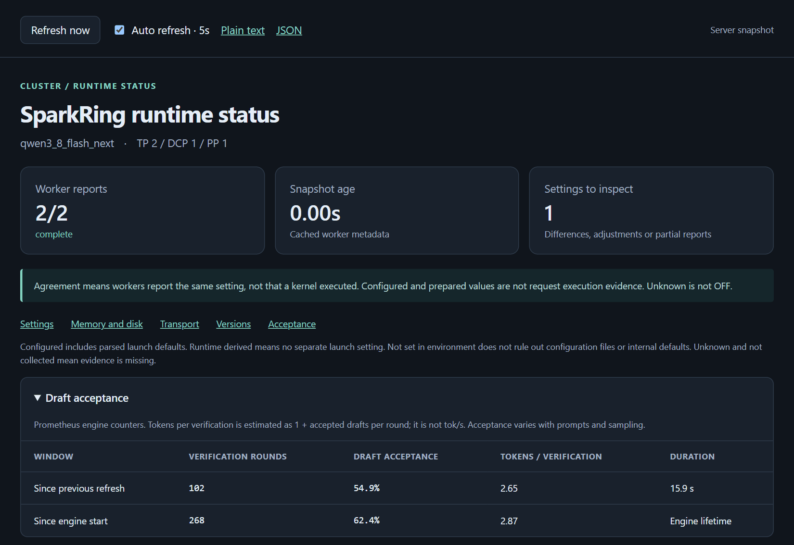
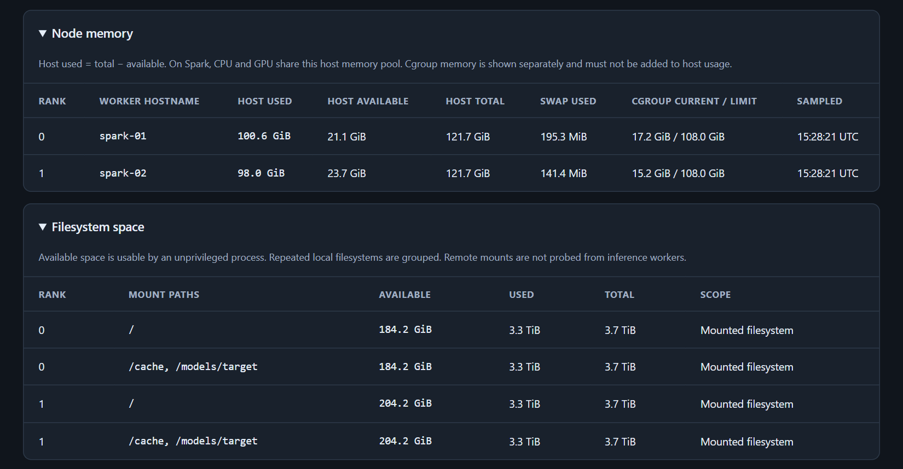
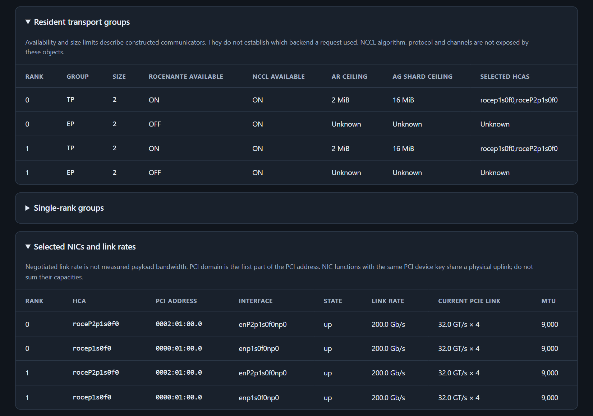
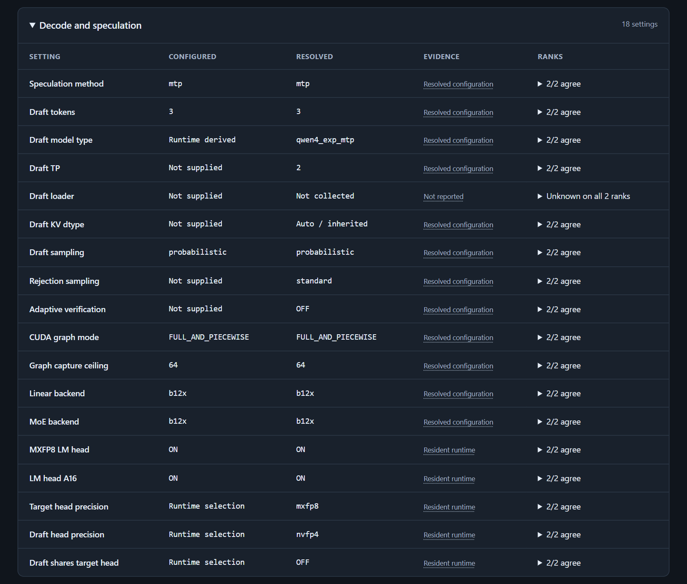

# Status dashboard

Every model that `sparkring install` starts serves a live status page from
Node A:

```text
http://NODE_A:PORT/v1/sparkring/status/view
```

`PORT` is the profile's API port: 8000, 8015 or 8020 (see
[Profiles](../../README.md#profiles)). The page refreshes every 5 seconds. It
only reads status: it runs no benchmark and changes no setting.



## What it shows

| Section | What you see |
|---|---|
| Summary | How many Sparks reported, how old the data is, and how many settings need a look |
| Draft acceptance | How many MTP draft tokens the model accepted, since the last refresh and since start, overall and per draft position |
| Memory and disk | Used and available memory on each Spark (CPU and GPU share it) and free disk space |
| Versions | NVIDIA driver, CUDA, NCCL, library and package versions on each Spark |
| Transport | Whether RoCEnante and NCCL are available, the NICs in use, link rates and RDMA traffic |
| Settings | Every serving setting as configured and as the model resolved it, and whether all Sparks agree |

The links under the summary jump to each section. Append `#nodes` to the
address to open it at memory and disk.







## From a terminal

The same report as text or JSON:

```bash
curl http://NODE_A:PORT/v1/sparkring/status.txt
curl http://NODE_A:PORT/v1/sparkring/status
```

`sudo sparkring status` checks the installation on every Spark and whether the
model is up; the dashboard shows how the running model is configured and
behaving.

## Access

The dashboard has the same access as the model API: no key, on every interface
of Node A. It shows hostnames, NIC MAC addresses and software versions, so keep
Node A on a trusted network ([Security](install.md#security)).
