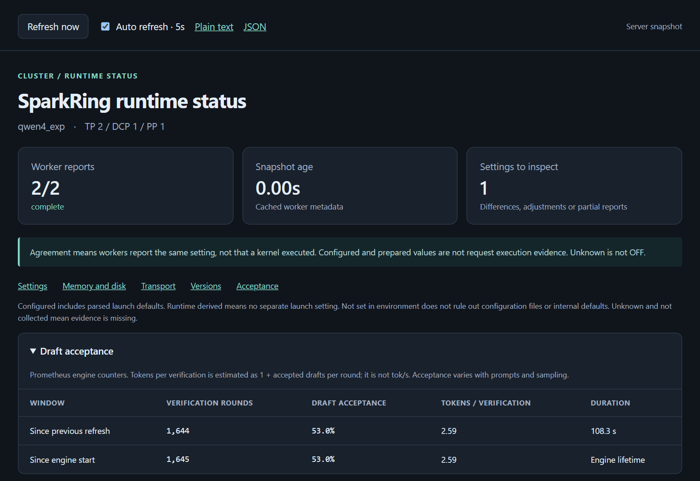
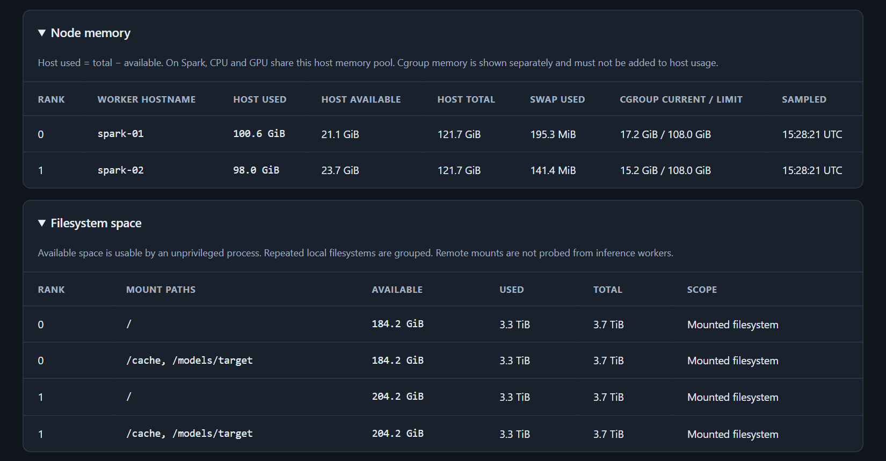
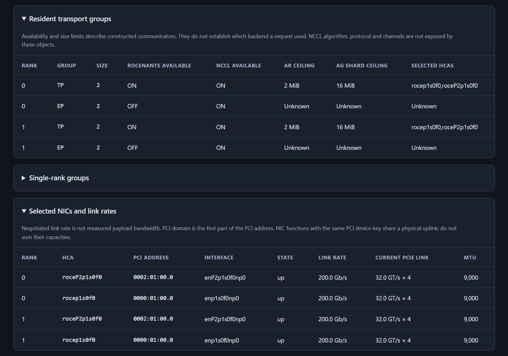
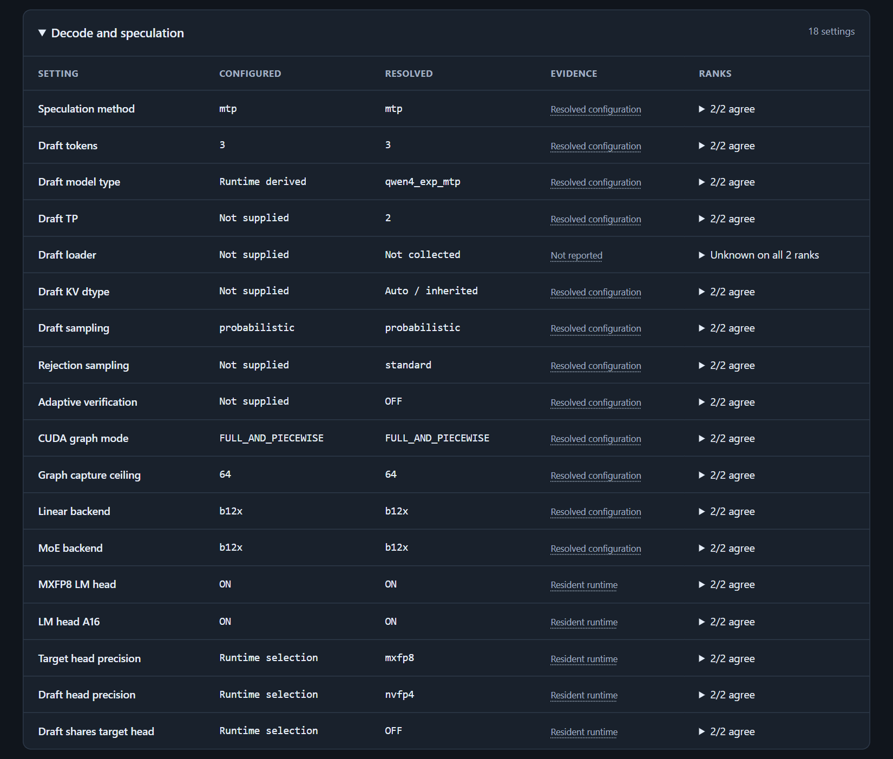

# Status dashboard

Every model that `sparkring install` starts serves a live status page from
Node A:

```text
http://NODE_A:PORT/v1/sparkring/status/view
```

`PORT` is the profile's API port: 8000, 8015 or 8020
([profile table](../../README.md#profiles)). The page refreshes every 5
seconds. It only reads status: it runs no benchmark and changes no setting.



## What it shows

| Section | What you see |
|---|---|
| Summary | Sparks reporting, data age and settings to check |
| Draft acceptance | MTP draft tokens accepted since the last refresh and since start, overall and per draft position |
| Memory and disk | Used and available memory on each Spark (CPU and GPU share it) and free disk space |
| Versions | NVIDIA driver, CUDA, NCCL, library and package versions on each Spark |
| Transport | Whether RoCEnante and NCCL are available, the NICs in use, link rates and RDMA traffic |
| Settings | Each serving setting as configured and as the model resolved it, and whether all Sparks agree |
| Workers | Draft tokens, KV transfer and kernel setup on each worker |
| Build information | Image, packages and source commits |

Links under the summary jump to each section. Add `#nodes` to the address to
open the page at memory and disk.

The `Chat and tools` settings table shows how the model API handles chat
requests:

| Row | What you see |
|---|---|
| Reasoning parser | The parser that separates the model's reasoning from its answer, or `None` |
| Tool-call parser | The parser that reads tool calls from the model's output |
| Default chat template arguments | Defaults passed to the chat template, such as `{"enable_thinking": false}`, or `Not set (the chat template decides)` |

The last two rows read `API server only`, because only Node A's API server holds
them. Thinking is set per request: a request's `chat_template_kwargs` or
`reasoning_effort` take precedence over these defaults, as the note under the
table says.

The `Decode and speculation` table ends with `Shared-memory reader window`: how
long vLLM's waiting processes poll after each step before they sleep. It reads
`2 ms (sparkring install --save-cpu)` with
[`--save-cpu`](install-reference.md#serving-settings) and `1 s (vLLM default)`
without.







## From a terminal

```bash
curl http://NODE_A:PORT/v1/sparkring/status.txt   # the report as text
curl http://NODE_A:PORT/v1/sparkring/status       # the report as JSON
vllm-top --url http://NODE_A:PORT                 # live rates
```

[vllm-top](https://github.com/mratsim/vllm-top) shows live prefill and decode
rates, queue, KV cache use and MTP acceptance.

`sudo sparkring status` checks the installation on every Spark and whether the
model is up; the dashboard shows how the running model is configured and
behaving.

## Access

Like the model API, the dashboard has no key and listens on every interface of
Node A. It shows hostnames, NIC MAC addresses and software versions, so keep
Node A on a trusted network ([Security](install.md#security)).

## Source

SparkRing's runtime-status vLLM plugin serves the page. Its source, response
schema, collection cost and offline tests are in
[integrations/vllm/runtime_status](../../integrations/vllm/runtime_status/README.md).
