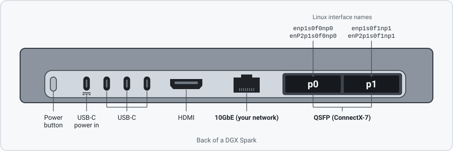
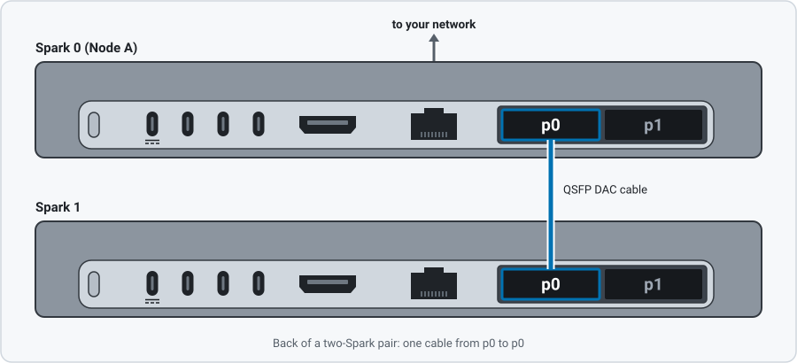
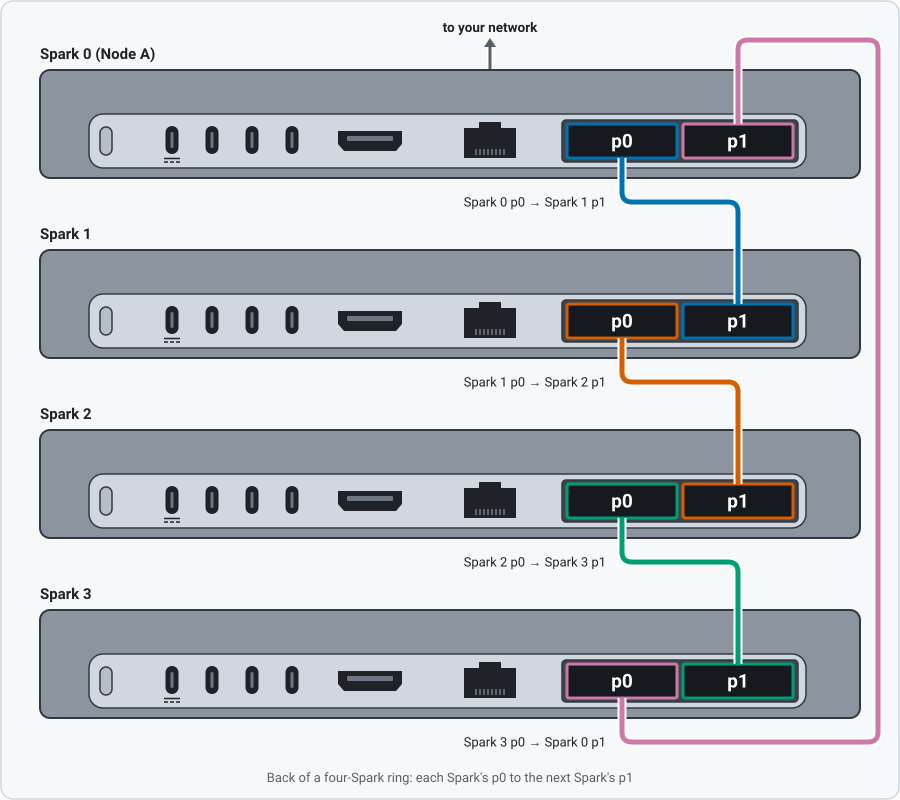

# Install SparkRing

`sparkring install` sets up two or four cabled DGX Sparks and starts one model.
Run it on Node A, the Spark connected to your network.

[All commands and flags](commands.md) · [Reference](install-reference.md)

## Requirements

- Two or four DGX Sparks on the same DGX OS (Ubuntu 24.04 ARM64) with working
  NVIDIA drivers, Docker, NVIDIA Container Toolkit, NetworkManager and SSH.
  Setup does not install drivers or firmware.
- Root or sudo on every Spark.
- Cables: a pair connects port p0 to p0; a four-Spark ring connects each
  Spark's p0 to the next Spark's p1. p0 is the QSFP port next to the 10GbE
  (RJ45) port.
- Node A on your network with outbound HTTPS to `ghcr.io`, `huggingface.co`,
  your Ubuntu mirror and, for four Sparks, `github.com`. Workers need no
  network cable.
- Free disk on each Spark that has neither the image nor the model: about
  203 GiB for Qwen, 278 GiB for MiMo or 280 GiB for GLM, plus 14.2 GiB on
  Node A.



<details>
<summary>Cabling diagrams for a pair and a four-Spark ring</summary>





</details>

Not supported: six-Spark rings, other port layouts, and Docker's containerd
image store ([check which one a Spark uses](install-reference.md#image-distribution-and-caches)).

## Install

```bash
curl -fsSL https://raw.githubusercontent.com/FujitsuPolycom/sparkring/one-command-installer/install.sh | bash -s -- --profile qwen38-flash-next-tp2
```

Use the `--profile` value for your model and Spark count from the
[profile table](../../README.md#profiles); without `--profile`, it asks. The
script builds and installs the SparkRing package, then runs
`sudo sparkring install` with your options. To install a published package
instead, see [Get the package](install-reference.md#get-the-package).

It lists every change and asks once (`Proceed? [Y/n]`). It asks again before a
large model download and before stopping another program's GPU container. It
prepares the image and model before it stops the running model, and restarts
the running model if the selected one fails to start. It ends with `Model ready:` and the
API URL. If it stops early, run the same command again; it continues where it
stopped.

## Four-Spark rings

The installer applies a ConnectX driver setting (hairpin) on every Spark and
repeats it at each boot, which adds about 30 seconds. After a reboot, start the
model with the same install command. If `sudo sparkring status` shows
`needs-attention`, run `sudo sparkring hairpin` on Node A.
[More about the setting](install-reference.md#four-spark-rings).

## Reuse a model already on disk

The installer looks for the model on every Spark (Hugging Face caches and
local model folders, never network storage), checks each file's SHA-256 and
hard-links it. It never changes your files. Sparks without a copy get one over
the cables. If the search misses your copy, name it:

```bash
# The same folder on every Spark
sudo sparkring install --profile qwen38-flash-next-tp2 --model-path /data/models/qwen

# A different folder per Spark (Node 0 is Node A)
sudo sparkring install --profile qwen38-flash-next-tp2 \
  --model-path 0=/data/models/qwen --model-path 1=/mnt/nvme/qwen
```

- `--ignore-local-copies` uses only SparkRing's own copies and the paths you
  name.
- To keep the search out of a folder: `touch /path/to/folder/.sparkring-ignore`.
- `sudo sparkring checkpoints` lists SparkRing's checkpoint folders and the
  space releasing each would free.
- `sudo sparkring checkpoints --release PATH` deletes that folder on every
  Spark after you confirm. Your own copies it linked from stay untouched, so
  only files SparkRing downloaded or copied free space. It refuses the folder
  of the running model.

## Logs and status

```bash
sudo sparkring logs --follow        # installation progress
sudo sparkring status --refresh     # each Spark's state and the installed model
sudo docker logs -f $(sudo docker ps -qf label=io.sparkring.rank=0)   # model server output, on Node A
```

For the running model, open the [status dashboard](dashboard.md), read it as
text with `curl http://NODE_A:PORT/v1/sparkring/status.txt`, or watch live
throughput with [vllm-top](https://github.com/mratsim/vllm-top). Installer logs
are in `/var/log/sparkring/`.

## Security

The model API has no key and listens on every interface of Node A: keep Node A
on a trusted network or firewall the port. Setup adds a WireGuard
administration network and an SSH service on port 2222 for Node A's key, and
shares Node A's Internet connection with the workers.
[Details](install-reference.md#security-and-host-exposure).

## Troubleshooting

| Symptom | Fix |
|---|---|
| `Some Sparks need noninteractive SSH and sudo` | Run the printed command on each listed Spark, then repeat |
| A Spark lacks free space | Free space where the message says, then repeat |
| The plan does not use your copy | `--model-path N=PATH` |
| `The checkpoint plan differs from the plan reviewed with --plan` | Run with `--plan` again, then `--yes` |
| `in use. No ConnectX driver was restarted` | Stop what the message lists, then repeat |
| The model is stopped after a reboot | Run the install command again |
| Deleting a copy freed no space | `sudo sparkring checkpoints --release PATH` |

## Uninstall

```bash
sudo sparkring down --execute   # on Node A: stop the model
sudo apt remove sparkring       # on each Spark
```

Removal stops SparkRing's services and keeps models, caches and network
settings. [What removal keeps](install-reference.md#what-is-installed).
