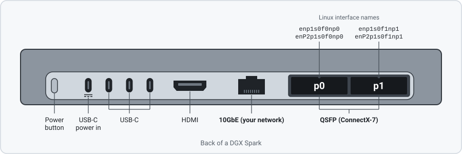
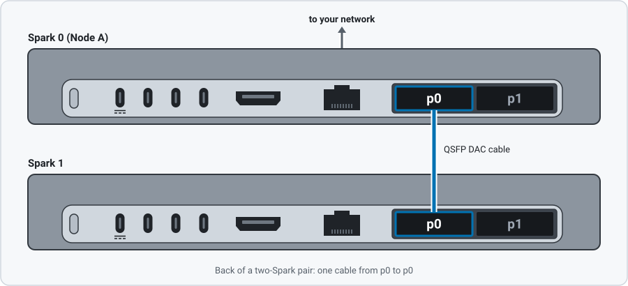
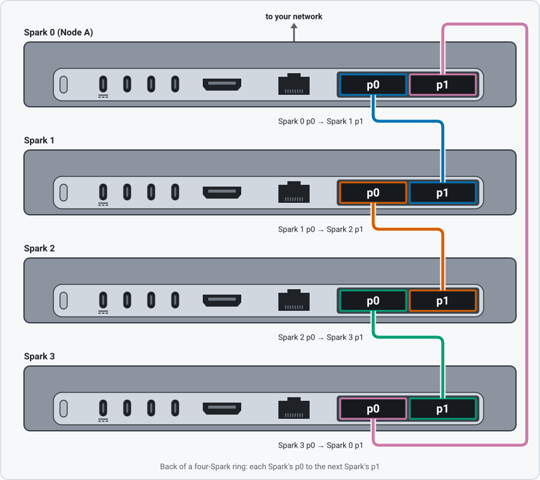

# Install SparkRing

`sparkring install` sets up two or four cabled DGX Sparks and starts one model.
Run it on Node A, the Spark connected to your network. `sparkring setup` also
forms lines and rings of up to eight Sparks
([fabrics](install-reference.md#fabrics-of-up-to-eight-sparks)); the
installer's profiles run on a pair or a four-Spark ring.

[All commands and flags](commands.md) · [Reference](install-reference.md)

## Requirements

- Two or four DGX Sparks on the same DGX OS (Ubuntu 24.04 ARM64) with working
  NVIDIA drivers, Docker, NVIDIA Container Toolkit, NetworkManager and SSH.
  Setup does not install drivers or firmware.
- Root or sudo on every Spark.
- Cables: a pair connects port p0 to p0; a ring connects each Spark's p0 to
  the next Spark's p1, and a line does the same from Node A without the last
  cable. p0 is the QSFP port next to the 10GbE (RJ45) port.
  `sudo sparkring cabling` checks them, prints which port leads to which
  Spark and names any cable to move.
- Node A on your network with outbound HTTPS to `github.com`,
  `raw.githubusercontent.com`, `ghcr.io`, `huggingface.co` and your Ubuntu
  mirror. Workers need no network cable.
- Free disk on each Spark that has neither the image nor the model: about
  163 GiB for Qwen, 233 GiB for MiMo, 236 GiB for GLM, 238 GiB for Swift or
  547 GiB for DeepSeek, plus 14.2 GiB on Node A. A Spark that kept the image
  of an earlier `sparkring install` needs about 47 GiB less.



<details>
<summary>Cabling diagrams for a pair and a four-Spark ring</summary>





</details>

Not supported: installer profiles on fabrics other than a pair or a
four-Spark ring, other port layouts, and Docker's containerd image store
([check which one a Spark uses](install-reference.md#image-distribution-and-caches)).

## Install

Pick the `--profile` value for your model and number of Sparks from the
[profile table](../../README.md#profiles), then run on Node A:

```bash
curl -fsSL https://raw.githubusercontent.com/FujitsuPolycom/sparkring/main/install.sh | bash -s -- --profile PROFILE
```

- It asks before it installs the SparkRing package, before it changes any
  Spark and before a model download larger than 1 GiB. `--yes` answers these.
- Stopping another program's GPU container always needs its own answer, or
  `--stop-workloads`. An unknown SSH host key always needs its own answer.
- `--plan` shows what it would change and changes nothing. On a Spark without
  SparkRing, run with `--package-only` first; it installs only the package.
- Qwen profiles install checkpoint step 5500; add `--checkpoint qad-step-4000`
  for step 4000. Two Qwen options trade a little quality for faster
  decoding: `--checkpoint qad-step5500-mxfp8-attention` builds step 5500
  with MXFP8 attention on the Sparks (it downloads 2.8 GB of step 4000;
  implemented), and `--checkpoint jmni-qad5500-hybrid` installs JMNI Labs'
  third-party hybrid (research-only). GLM profiles install NVFP4-Spark; add `--checkpoint nvfp4-qad`
  for Local Inference Lab's QAD checkpoint, or on four Sparks
  `--checkpoint nvidia-nvfp4` for NVIDIA's NVFP4 checkpoint. On two Sparks, QAD
  runs with a shorter context window
  ([checkpoints](install-reference.md#another-checkpoint-of-a-profile)).
- `--download-limit 850Mbit` caps the model download from Hugging Face
  ([details](install-reference.md#limit-the-download-rate)).

A model that is already running keeps serving while the selected model's image
and weights are prepared, and runs again if the selected model fails to start.
A download shows how much is done and the time left. The first start on new
Sparks can take 10 to 30 minutes; progress names what the model is doing.

The install ends with `Model ready:`, the API and dashboard addresses, a sample
request and the commands to switch back or stop. If it stops early, run the
same command again; it continues where it stopped.

The command installs the newest SparkRing from `main`. To repeat an
installation exactly, use the
[pinned command](install-reference.md#get-the-package) with the
`Source revision:` it printed; that section also covers installing a published
package.

## Four-Spark rings

The installer applies a ConnectX driver setting (hairpin) on every Spark and
repeats it at each boot, which adds about 30 seconds. It also installs the
fabric's [relay table](install-reference.md#the-relay-table), which the Sparks
restore at every boot. After a reboot, `sudo sparkring fabric verify` checks
the fabric; start the model with the same install command. If
`sudo sparkring status` shows `needs-attention`, run `sudo sparkring hairpin`
on Node A. [More about the setting](install-reference.md#four-spark-rings).

A ring can also serve two two-Spark models, one on each half:
`sudo sparkring install --profile PROFILE --on 0,1`, then `--on 2,3`.
[Two models on one ring](install-reference.md#two-models-on-one-ring).

## Reuse a model already on disk

The installer looks for the model on every Spark (Hugging Face caches and
local model folders, never network storage), checks each file's SHA-256 and
hard-links it. It never changes your files. Sparks without a copy get one over
the cables. If the search misses your copy, name it:

```bash
# The same folder on every Spark
sudo sparkring install --profile PROFILE --model-path /data/models/my-model

# A different folder per Spark (Node 0 is Node A)
sudo sparkring install --profile PROFILE \
  --model-path 0=/data/models/my-model --model-path 1=/mnt/nvme/my-model
```

- `--ignore-local-copies` uses only SparkRing's own copies and the paths you
  name.
- To keep the search out of a folder: `touch /path/to/folder/.sparkring-ignore`.
- `sudo sparkring checkpoints` lists SparkRing's checkpoint folders and the
  space releasing each would free.
- `sudo sparkring checkpoints --release PATH` deletes that folder on every
  Spark after you confirm. Your own copies it linked from stay untouched, so
  only files SparkRing downloaded or copied free space. It refuses the folder
  of the running model.

## Logs and status

```bash
sudo sparkring logs --follow        # installation progress
sudo sparkring status --refresh     # each Spark's state and the installed model
sudo docker logs -f $(sudo docker ps -qf label=io.sparkring.rank=0)   # model server output, on API_HOST
```

`API_HOST` is the Spark that serves the model's API: Node A, or Spark 2 for a
model on Sparks 2 and 3. For the running model, open the
[status dashboard](dashboard.md), read it as text with
`curl http://API_HOST:PORT/v1/sparkring/status.txt`, or watch live throughput
with [vllm-top](https://github.com/mratsim/vllm-top). Installer logs are in
`/var/log/sparkring/`.

Scripts and agents can add `--events FILE` to get progress as one JSON object
per line ([fields](install-reference.md#event-stream)).

## Security

The model API has no key and listens on every interface of `API_HOST`: keep
that Spark on a trusted network or firewall the port. Setup adds a WireGuard
administration network and an SSH service on port 2222 for Node A's key, and
shares Node A's Internet connection with the workers.
[Details](install-reference.md#security-and-host-exposure).

## Troubleshooting

| Symptom | Fix |
|---|---|
| `Some Sparks need noninteractive SSH and sudo` | Run the printed command on each listed Spark, then repeat |
| A Spark lacks free space | Free space where the message says, then repeat |
| The plan does not use your copy | `--model-path N=PATH` |
| `The checkpoint plan differs from the plan reviewed with --plan` | Run with `--plan` again, then `--yes` |
| `in use. No ConnectX driver was restarted` | Stop what the message lists, then repeat |
| The model stops answering after a Spark restarts | Run the install command again |
| A model log shows `NVMLError_Unknown` or `Can't initialize NVML` | Run the install command again; it gives the model its GPU in a way that survives system updates. [Details](install-reference.md#install-a-model) |
| Deleting a copy freed no space | `sudo sparkring checkpoints --release PATH` |

## Uninstall

```bash
sudo sparkring down --execute   # on Node A: stop the model
sudo apt remove sparkring       # on each Spark
```

Removal stops SparkRing's services and keeps models, caches and network
settings. [What removal keeps](install-reference.md#what-is-installed).
