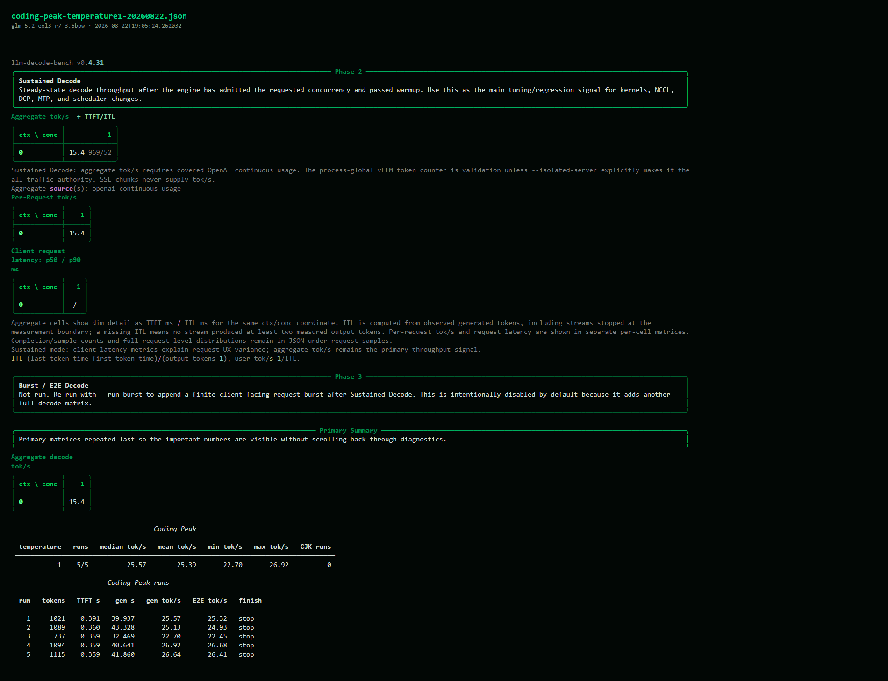

# GLM-5.2 EXL3 3.5-bpw normalized base benchmark

| Field | Value |
|---|---|
| Lane | public-functional |
| Status | **live-validated candidate** — tested on hardware, not qualified |
| Hardware | four directly cabled NVIDIA DGX Sparks in a cycle, TP4/DCP4 |
| Sampling | temperature 1.0, top-p 0.95 from the checkpoint generation configuration |

These results apply only to fixed MTP4 with greedy draft proposals, dynamic
NVFP4 MLA plus FP8 RoPE, a 1,048,576-token request limit, 16 sequences, 4,096
batched tokens, 9.25 GB KV per rank, block size 64, native prefix caching,
target-only exact Q40, and no SparkCache.

## Prefill

| Context | Prompt tokens | TTFT | Prompt tok/s |
|---:|---:|---:|---:|
| 2K | 2,050 | 2.95 s | 694 |
| 8K | 8,194 | 12.14 s | 675 |
| 16K | 16,386 | 24.41 s | 671 |
| 32K | 32,770 | 49.56 s | 661 |
| 64K | 65,538 | 100.92 s | 649 |
| 128K | 131,073 | 206.55 s | 635 |

## Sustained decode

Aggregate generated tokens per second:

| Context | C1 | C2 | C4 | C8 |
|---:|---:|---:|---:|---:|
| 2K | 22.00 | 28.28 | 46.98 | 67.62 |
| 8K | 19.15 | 30.21 | 47.70 | 65.53 |
| 16K | 20.15 | 32.38 | 45.38 | 62.71 |
| 32K | 21.61 | 30.52 | 46.08 | 62.88 |
| 64K | 20.17 | — | — | — |
| 128K | — | — | — | — |

Every displayed decode cell had complete client accounting, exact
client/server agreement, requested concurrency, zero queue/errors, and clean
all-rank logs. Displayed cells are one accepted observation each.

## Coding workload

Coding Peak at temperature 1.0 completed five normal requests: mean
25.39 tok/s, median 25.57, range 22.70–26.92 tok/s.

## Limits and restart behavior

The stack reached ready state from fresh rank-specific JIT and create-once
receipt namespaces. Restarting a preserved container in the same namespace
fails before model startup because the exact-Q40 producer refuses to overwrite
its existing receipt. Preserve the receipt and use a fresh namespace until the
launcher can safely revalidate and reuse an exact match.

- 64K C2/C4/C8 and all 128K decode cells remain unmeasured.
- Rows named `DISCARD`, `ABORTED`, JIT-affected, or with request errors are excluded.
- Saved last-scrape acceptance is not used as a run average.
- Pre-boundary-fix hardware summaries are not used for exact thermal claims.
- Available memory was approximately 1.3–3.5 GB per rank during this campaign.
- Sanitized decode and Coding Peak receipts are published in the
  [receipt bundle](../../receipts/glm-3.5bpw/temp1/). Endpoint bindings, SSH
  targets, local paths, event logs, and unreliable hardware summaries are
  removed; each file retains a public replay command and the private source
  receipt's SHA-256 digest.
- Prefill TTFT values are retained because they end before sampled decode.
- [The machine-readable summary](normalized-base-20260822.json) records the
  displayed values and pending coordinates.
