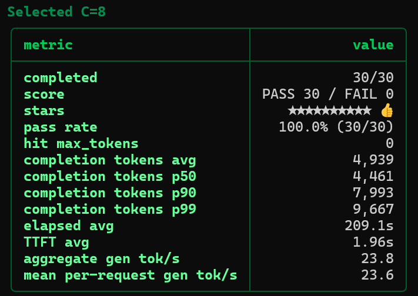

# GLM-5.3 Flash Spark long-context country recall

Status: **research-only** operator observation. Thirty requests to one
133,208-token prompt passed at concurrency eight. This is not a general
accuracy benchmark or a matched transport comparison.

## Conditions

The benchmark identifies served model `glm-5.3-flash-spark`, harness version
0.4.32, and the `estonia` country-recall profile version 2. The operator
associates the result with the native-MTP3 hybrid mesh profile. The benchmark
does not capture an immutable runtime image or transport manifest, so this
result does not qualify the published image's performance.

The prompt contains 707,468 characters and has SHA-256
`8c045ba5e8299b2516d81603ba1bc27bad9fcf3583de0aecbf89a9d66b131942`.
The country-exact scorer version 2 checks the asserted final answer against
Estonia and distinguishes the decoy Latvia. Thirty measured requests used
temperature 1.0, seed base 1000, concurrency eight, and an output limit of
40,000 tokens. One scout request primes the prefix cache before measurement.

## Measurement

The [numeric record](spark-mtp3-country-recall-20260905.json) retains all
30 per-request token counts, durations, scores, and completion flags without
publishing response text or site addresses. Its original benchmark JSON has
SHA-256 `3812663acfb7dba1e2cf0ef675f6be180732796fc169556823f326e9bed6a63c`.

Completion counts use OpenAI usage values; no request used estimated tokens.
TTFT and elapsed durations are client measurements. The screenshot's
**aggregate gen tok/s** is `sum(completion_tokens) / sum(gen_elapsed)`.
Because concurrent request durations overlap, this is a request-time-weighted
rate, **not cluster wall-clock throughput**. It is not comparable to the
sustained aggregate decode metric in the [throughput matrix](spark-mtp3-mesh-20260905.md).

## Result

| Metric | Observation |
|---|---:|
| Concurrency | 8 |
| Prompt tokens per request | 133,208 |
| Completed / attempted | 30 / 30 |
| Correct final country | 30 / 30 (100%) |
| Errors / output-limit hits | 0 / 0 |
| Completion tokens, mean | 4,939 |
| Completion tokens, p50 / p90 / p99 | 4,461 / 7,993 / 9,667 |
| Mean request elapsed time | 209.1 s |
| Mean cache-primed TTFT | 1.96 s |
| Request-time-weighted generation rate | 23.8 tok/s |
| Mean per-request generation rate | 23.6 tok/s |

The screenshot preserves the harness's original labels. The definition above
clarifies the scope of its aggregate-generation row.

## Conclusion

All thirty repeated requests returned the expected country without errors,
truncation, or output-budget hits under the recorded conditions. This is a
bounded long-context concurrency observation, not evidence that the model
answers every long-context task correctly.

## Limitations

- One repeated prompt is not thirty independent tasks; no general accuracy
  estimate or transport-attributable speedup is claimed.
- Cache-primed TTFT is not cold-prefill latency.
- No exact harness source revision, runtime image, or transport manifest is
  recorded by this benchmark.
- Within-run distributions do not establish run-to-run reproducibility.
