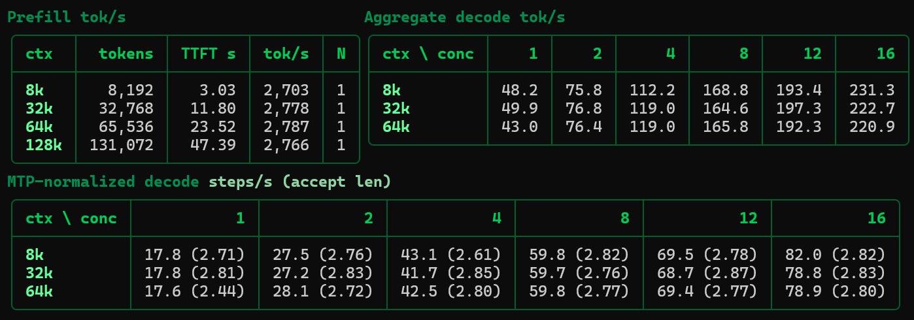

# GLM-5.3 Flash Spark native-MTP3 mesh serving observations

Status: **research-only**. This record describes one four-rank serving run,
not a comparison against another model, speculation method, or transport.
The [sanitized numeric record](spark-mtp3-mesh-20260905.json) preserves the
source values needed to reproduce the tables.

## Conditions

- Four NVIDIA DGX Spark GB10 systems connected in the physical ring
  `0-1-2-3-0`, with two Socket Direct functions on each physical port.
- Target `local-inference-lab/GLM-5.3-Flash-NVFP4-Spark` revision
  `df116c4fb16b1d37ae43d2cfd624de26ffbc832e`; built-in MTP depth three, draft
  TP4, no external draft model.
- TP4/DCP4/PP1, BF16 compute, ModelOpt mixed quantization, FP8 KV allocation
  24 GiB per rank, 16 sequences, 8,192 batched tokens, prefill interval two,
  asynchronous scheduling, chunked prefill, and prefix caching.
- B12X attention, KDA, linear, and MoE kernels from the pinned operator image;
  graph shapes 4, 8, 12, ..., 64.
- Image ID
  `sha256:5e32aaa1bbe3559e81db7706ed4286248f18d27cfdb186f6b851bf786eb43075`.
  The immutable registry reference is recorded by the
  [runtime image pins](../../../runtime/glm53-flash-jj-r8-gb10/pins.json).
- Measured transport bundle manifest SHA-256
  `701bdc42069a97492981b8f34e006ebfa9e68c2160472cba631b56965efae226`.
  Captured Q16/Q20/Q24/Q28/Q32 delegate to SIRCL; eligible smaller captured
  and eager operations use RoCEnante; large eager prefill uses fused SIRCL.
  Opposite-peer RoCEnante paths use ConnectX-7 hardware forwarding.
- SparkCache read-write with `tail-cow-v2`. Decode follows context
  preparation with caching enabled; prefill values are integrated scouts.
- Harness version 0.4.32, temperature 1.0, maximum output 2,048 tokens,
  ignore-EOS enabled, requested five-second decode warmup, 900-second cell
  warmup timeout, 20-second sustained windows. One observation per cell.

The original benchmark JSON has SHA-256
`f0916f6b72cb8256225169b44c4f11e3ca764a5dd854977b8963686197b843fa`.
Its filename contains an external-draft label, but the captured serving
configuration identifies native MTP3. The sanitized record uses the source
hash rather than treating that filename as model metadata. Site addresses,
client identity, and unrelated raw log data are not published.

## Measurement

Aggregate decode throughput is the continuous OpenAI stream-usage output
token count divided by the recorded measurement duration. Counts and timing
denominators are retained per cell in the numeric record. The headline is
neither a GPU-event measurement nor request-completion throughput.

All 18 decode cells report zero request errors, effective concurrency equal
to the requested value, and no underfilled, warmup-timeout, or capacity-limit
flags. The benchmark's derived normalized-step rate divides aggregate output
throughput by effective speculative acceptance length. It does not directly
count GPU forward invocations or measure transport latency.

Prefill is client prompt tokens divided by time to first token, using the
source's recorded scout precision. Each context has one scout. The 8K, 32K,
and 64K scouts have server computed-token corroboration; the 128K scout does
not. These are not repeated strict cold-cache measurements. No run-to-run
confidence interval can be calculated from one sample per cell.

## Result

The screenshot's MTP-normalized rates are derived token/acceptance ratios,
not directly measured GPU forward-pass counts. Numeric tables follow.

Aggregate decode throughput, output tokens per second:

| Context tokens | C1 | C2 | C4 | C8 | C12 | C16 |
|---:|---:|---:|---:|---:|---:|---:|
| 8,192 | 48.2 | 75.8 | 112.2 | 168.8 | 193.4 | 231.3 |
| 32,768 | 49.9 | 76.8 | 119.0 | 164.6 | 197.3 | 222.7 |
| 65,536 | 43.0 | 76.4 | 119.0 | 165.8 | 192.3 | 220.9 |

Mean speculative acceptance length, including the target token:

| Context tokens | C1 | C2 | C4 | C8 | C12 | C16 |
|---:|---:|---:|---:|---:|---:|---:|
| 8,192 | 2.71 | 2.76 | 2.61 | 2.82 | 2.78 | 2.82 |
| 32,768 | 2.81 | 2.83 | 2.85 | 2.76 | 2.87 | 2.83 |
| 65,536 | 2.44 | 2.72 | 2.80 | 2.77 | 2.77 | 2.80 |

Prefill scouts at concurrency one:

| Prompt tokens | Client TTFT, seconds | Prompt tokens/second | Samples |
|---:|---:|---:|---:|
| 8,192 | 3.031 | 2,703 | 1 |
| 32,768 | 11.797 | 2,778 | 1 |
| 65,536 | 23.516 | 2,787 | 1 |
| 131,072 | 47.390 | 2,766 | 1 |

## Conclusion

The identified native-MTP3 and hybrid-mesh deployment completed the reported
decode matrix without the benchmark's concurrency or error gates firing.
Aggregate decode reached 231.3 tokens/second at 8K/C16 in this run. The
scouts observed 2,703–2,787 prompt tokens/second over their reported contexts.
The data do not isolate gains attributable to MTP, SIRCL, RoCEnante, or
hardware-forwarded paths.

## Limitations

- No repeated cells, randomized ordering, or matched comparison arm. An exact
  harness source digest and prompt RNG seed are not recorded in the source
  JSON; version 0.4.32 alone is not a complete harness revision identity.
- Sustained duration windows are not finite-request end-to-end tests. The
  normalized-step metric must not be presented as measured GPU execution.
- The benchmark does not establish per-cell transport-counter attribution,
  tensor-level correctness, deterministic model-output correctness, or
  marker-expiry failure containment.
- The packaged profile's manifest
  `4204fabc93303226b9a120b094ef3c82ed4aadd1d7f97cfbe291204c027ed45f`
  uses identical executable files and parsed routing configuration, with
  canonical JSON line endings. Its native-MTP cache identity uses the target
  checkpoint and a dedicated namespace instead of external-draft-tagged
  cache entries. Clean startup and persistent restore of that packaged
  namespace require separate qualification.
- The configured one-million-token request limit is not a measurement at
  that length. Results apply only to the contexts, concurrency, sampling,
  cache state, image, and topology described here.

The [MTP3 mesh quickstart](../../../docs/GLM53_SPARK_MTP3_MESH_QUICKSTART.md)
documents the profile's operational requirements and remaining gates.
