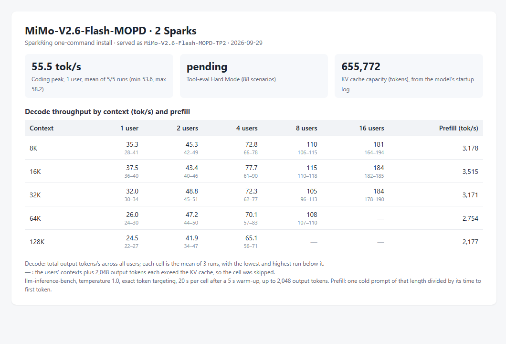

# MiMo-V2.6-Flash-MOPD on two Sparks: decode and prefill by context

Status: **implemented; measured on one pair of DGX Sparks; three runs per cell; not serving-qualified**.

## Conditions

- Profile `mimo-v26-flash-mopd-tp2` and installer code of `main` at `721db585`; two reinstalls used
  `59b253fd`, which differs only in `README.md`. Installer image
  [`dev-20260928-plainstatus-cuda1342-nccl2323-status033`](../../../runtime/releases/dev-20260928-plainstatus-cuda1342-nccl2323-status033/release.json).
- Checkpoint `XiaomiMiMo/MiMo-V2.6-Flash-MOPD` revision `2479e2d0029e`, served as `MiMo-V2.6-Flash-MOPD-TP2`.
- KV cache: 655,772 tokens, from the `GPU KV cache size` line of the rank-0 startup log. The profile serves at most 16 requests at once.
- Client: a separate machine on Node A's network.

## Measurement

- **Decode and prefill:** [llm-inference-bench](https://github.com/local-inference-lab/llm-inference-bench) `llm_decode_bench.py` 0.6.2, three runs of the same matrix: 1, 2, 4, 8 and 16 concurrent
  streams at 8K, 16K, 32K, 64K and 128K tokens of context, temperature 1.0, exact token
  targeting, 20 s per cell after a 5 s warm-up, up to 2,048 output tokens with end of sequence
  ignored. The benchmark received the KV cache size above and skipped cells whose streams
  need more, concurrency × (context + 2,048) tokens. Decode is the aggregate output rate;
  prefill is one cold prompt of each length divided by its time to first token.
- **Coding peak:** the same benchmark's coding probe, one stream writing a Sieve of Eratosthenes
  program, five runs of up to 2,000 tokens at temperature 1.0.

## Result

Decode (tok/s): mean of the three runs, lowest and highest run in
brackets. Prefill (tok/s) per context length.

| Context | 1 user | 2 users | 4 users | 8 users | 16 users | Prefill |
|---|---|---|---|---|---|---|
| 8K | 35.3 (28.0–40.5) | 45 (42–49) | 73 (66–78) | 110 (106–115) | 181 (164–194) | 3,178 (3,178–3,178) |
| 16K | 37.5 (35.9–39.6) | 43 (40–46) | 78 (61–90) | 115 (110–118) | 184 (182–185) | 3,515 (3,507–3,531) |
| 32K | 32.0 (30.5–33.6) | 49 (45–51) | 72 (62–77) | 105 (96–113) | 184 (178–190) | 3,171 (3,163–3,177) |
| 64K | 26.0 (24.0–29.7) | 47 (44–50) | 70 (57–83) | 108 (107–110) | — | 2,754 (2,750–2,761) |
| 128K | 24.5 (21.8–26.6) | 42 (34–47) | 65 (56–71) | — | — | 2,177 (2,166–2,183) |

— : the cell exceeds the KV cache and was skipped.

Coding peak: 55.5 tok/s mean over 5 of 5 runs (53.6–58.2).
Tool calling was not measured for this profile.

Files: [matrices](dev-20260928-plainstatus-mimo-v26-flash-mopd-tp2-context-20260929/run1-matrix.json) (runs [1](dev-20260928-plainstatus-mimo-v26-flash-mopd-tp2-context-20260929/run1-matrix.json), [2](dev-20260928-plainstatus-mimo-v26-flash-mopd-tp2-context-20260929/run2-matrix.json), [3](dev-20260928-plainstatus-mimo-v26-flash-mopd-tp2-context-20260929/run3-matrix.json)), [coding peak](dev-20260928-plainstatus-mimo-v26-flash-mopd-tp2-context-20260929/coding-peak.json).

## Conclusion

On one pair of DGX Sparks, `mimo-v26-flash-mopd-tp2` decoded 37.5 / 78 / 115 / 184 tok/s at 1 / 4 / 8 / 16 users with 16K tokens of context each, and prefilled a cold 64K-token prompt at 2,754 tok/s. These are the README profile table's values.

## Limitations

- One cluster. At temperature 1.0 the tokens accepted per speculative step follow the sampled text, so decode rates vary between runs; the brackets give the spread of three runs.
- Prefill is one cold prompt per length and run.
- Throughput only: the correctness checks of each profile are in its acceptance records.
