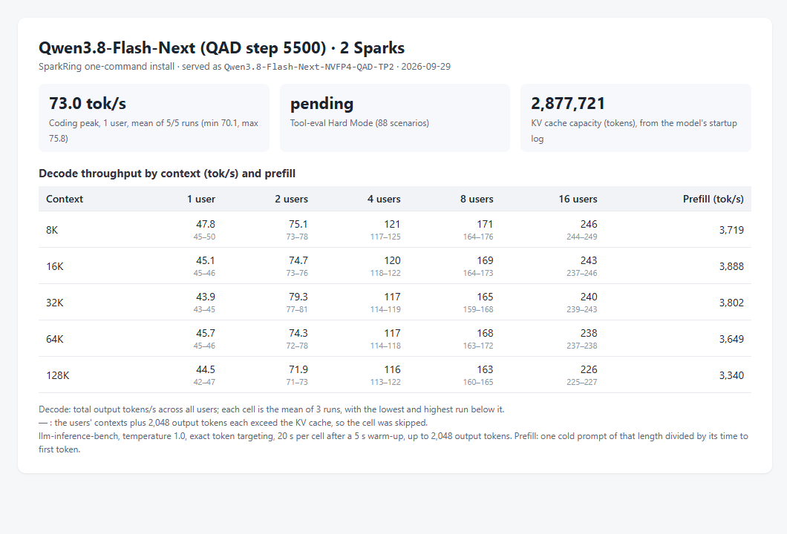

# Qwen3.8-Flash-Next NVFP4 QAD on two Sparks: decode and prefill by context

Status: **implemented; measured on one pair of DGX Sparks; three runs per cell; not serving-qualified**.

## Conditions

- Profile `qwen38-flash-next-tp2` and installer code of `main` at `721db585`; two reinstalls used
  `59b253fd`, which differs only in `README.md`. Installer image
  [`dev-20260928-plainstatus-cuda1342-nccl2323-status033`](../../../runtime/releases/dev-20260928-plainstatus-cuda1342-nccl2323-status033/release.json).
- Checkpoint `local-inference-lab/Qwen3.8-Flash-Next-NVFP4` revision `60215d26cf5e`, served as `Qwen3.8-Flash-Next-NVFP4-QAD-TP2`.
- KV cache: 2,877,721 tokens, from the `GPU KV cache size` line of the rank-0 startup log. The profile serves at most 16 requests at once.
- Client: a separate machine on Node A's network.

## Measurement

- **Decode and prefill:** [llm-inference-bench](https://github.com/local-inference-lab/llm-inference-bench) `llm_decode_bench.py` 0.6.2, three runs of the same matrix: 1, 2, 4, 8 and 16 concurrent
  streams at 8K, 16K, 32K, 64K and 128K tokens of context, temperature 1.0, exact token
  targeting, 20 s per cell after a 5 s warm-up, up to 2,048 output tokens with end of sequence
  ignored. The benchmark received the KV cache size above and skipped cells whose streams
  need more, concurrency × (context + 2,048) tokens. Decode is the aggregate output rate;
  prefill is one cold prompt of each length divided by its time to first token.
- **Coding peak:** the same benchmark's coding probe, one stream writing a Sieve of Eratosthenes
  program, five runs of up to 2,000 tokens at temperature 1.0.

## Result

Decode (tok/s): mean of the three runs, lowest and highest run in
brackets. Prefill (tok/s) per context length.

| Context | 1 user | 2 users | 4 users | 8 users | 16 users | Prefill |
|---|---|---|---|---|---|---|
| 8K | 47.8 (45.1–50.1) | 75 (73–78) | 121 (117–125) | 171 (164–176) | 246 (244–249) | 3,719 (3,692–3,746) |
| 16K | 45.1 (44.6–45.7) | 75 (73–76) | 120 (118–122) | 169 (164–173) | 243 (237–246) | 3,888 (3,883–3,898) |
| 32K | 43.9 (43.5–44.6) | 79 (77–81) | 117 (114–119) | 165 (159–168) | 240 (239–243) | 3,802 (3,786–3,813) |
| 64K | 45.7 (45.2–46.4) | 74 (72–78) | 117 (114–118) | 168 (163–172) | 238 (237–238) | 3,649 (3,634–3,663) |
| 128K | 44.5 (42.1–47.0) | 72 (71–73) | 116 (113–122) | 163 (160–165) | 226 (225–227) | 3,340 (3,326–3,349) |

— : the cell exceeds the KV cache and was skipped.

Coding peak: 73.0 tok/s mean over 5 of 5 runs (70.1–75.8).
Tool calling was not measured for this profile.

Files: [matrices](dev-20260928-plainstatus-qwen38-flash-next-tp2-context-20260929/run1-matrix.json) (runs [1](dev-20260928-plainstatus-qwen38-flash-next-tp2-context-20260929/run1-matrix.json), [2](dev-20260928-plainstatus-qwen38-flash-next-tp2-context-20260929/run2-matrix.json), [3](dev-20260928-plainstatus-qwen38-flash-next-tp2-context-20260929/run3-matrix.json)), [coding peak](dev-20260928-plainstatus-qwen38-flash-next-tp2-context-20260929/coding-peak.json).

## Conclusion

On one pair of DGX Sparks, `qwen38-flash-next-tp2` decoded 45.1 / 120 / 169 / 243 tok/s at 1 / 4 / 8 / 16 users with 16K tokens of context each, and prefilled a cold 64K-token prompt at 3,649 tok/s. These are the README profile table's values.

## Limitations

- One cluster. At temperature 1.0 the tokens accepted per speculative step follow the sampled text, so decode rates vary between runs; the brackets give the spread of three runs.
- Prefill is one cold prompt per length and run.
- Throughput only: the correctness checks of each profile are in its acceptance records.
