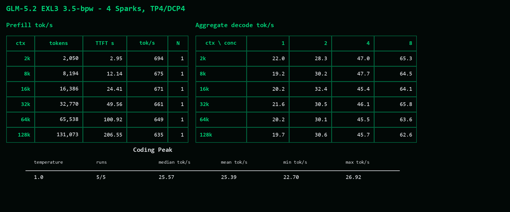

# GLM-5.2 EXL3 3.5-bpw four-Spark quickstart

Profile: `glm52-exl3-r7-3.5bpw`. Status: **implemented**. The recipe records configuration and evidence boundaries. Its implementation status does not qualify a rebuilt image.

Inspect its selected defaults with `python scripts/profiles.py resolve glm52-exl3-r7-3.5bpw`.

This quickstart deploys the tested 1,048,576-token, 16-sequence GLM-5.2 EXL3
profile on four directly cabled NVIDIA DGX Sparks. The machine-readable settings are in
[`recipes/glm52-exl3-r7-3.5bpw.json`](../../recipes/glm52-exl3-r7-3.5bpw.json).

## Serving contract

| Setting | Value |
|---|---|
| Checkpoint | `brandonmusic/GLM-5.2-EXL3-TR3v4-3.5bpw-MTP78@9ab9579774cc432df91567a36f6e9e863e0d4c9f` |
| Config SHA-256 | `fabb73eb513ec64f3a365da396b38de8d55b3930edfb11baeecbf34ecafa6126` |
| Index SHA-256 | `9fd852f69ed64442e31dce1cbc5fe7acd0a76bfb848e945d272fe98d00d0c9cd` |
| Parallelism | TP4, DCP4 `ag_rs` |
| Speculation | fixed MTP4 |
| Request limit | 1,048,576 tokens |
| Key-value cache | `nvfp4_ds_mla`, 9,250,000,000 bytes per rank |
| Maximum sequences | 16 |
| Key-value block size | 64 tokens |
| Tensor-parallel transport | SIRCL with patched NCCL fallback |

## 1. Prepare the four ranks

Complete [the prerequisites](../../docs/operations/prerequisites.md). Copy the site template to the
ignored local configuration, replace every placeholder, and use one identical
model path on every rank.

```bash
mkdir -p .sparkring/exl3-r7
cp scripts/config/exl3-r7-site.example.yaml .sparkring/exl3-r7/site.yaml
$EDITOR .sparkring/exl3-r7/site.yaml
python scripts/sparkring_site.py .sparkring/exl3-r7/site.yaml
python scripts/preflight.py --site .sparkring/exl3-r7/site.yaml --print-plan
```

The printed plan is offline. Run the command without `--print-plan` only after
reviewing it; that contacts the configured hosts but does not mutate them.

## 2. Download and verify the checkpoint

Download the pinned checkpoint to the model path configured in the site file.

```bash
python scripts/download_exl3_r7.py download \
  --model-path /var/tmp/sparkring-r7-model
python scripts/download_exl3_r7.py verify \
  --model-path /var/tmp/sparkring-r7-model
```

The pinned checkpoint contains 157 weight shards. The index total is
346,218,639,128 bytes.

## 3. Build and identify the runtime image

Pull the published ARM64 serving image as the builder's pinned parent:

```bash
docker pull ghcr.io/fujitsupolycom/gb10-vllm-serving@sha256:6fc26fdad81a18f0fff67ce0a05f6d90165625ea2e1cac8a6f39bfb462017028
docker image inspect \
  ghcr.io/fujitsupolycom/gb10-vllm-serving@sha256:6fc26fdad81a18f0fff67ce0a05f6d90165625ea2e1cac8a6f39bfb462017028 \
  --format '{{.Id}}'
```

Build on an ARM64 host from the tracked runtime inputs. Supply that immutable
parent reference, the local image ID reported by Docker, and the audited SPDX
license expression for the exact parent:

```bash
BASE_IMAGE='<parent-image-tag>' \
BASE_IMAGE_ID='<parent-image-sha256-id>' \
BASE_IMAGE_LICENSES='<parent-image-spdx-expression>' \
  ./runtime/exl3-r7/build-image.sh
```

Mixed EXL3 execution at exactly 40 query rows requires an image-bound state
attestation. The tools call this shape `Q40`; their attestation generator requires
`--image-id` and binds its output to the derived image. Record the immutable Docker image ID and set both runtime image fields in
`.sparkring/exl3-r7/site.yaml` before generating the launch profile.

```bash
docker image inspect <your-image-ref> --format '{{.Id}}'
```

```yaml
runtime:
  container_image: <your-image-ref>
  container_image_digest: <your-image-id>
```

## 4. Generate the serving profile before state attestation

Build and test the native SIRCL library, then create a local candidate template
whose image and host paths match `.sparkring/exl3-r7/site.yaml`.

```bash
cmake -S spark_transport -B build/sircl-tiered \
  -DCMAKE_BUILD_TYPE=Release \
  -DCMAKE_CUDA_ARCHITECTURES=121
cmake --build build/sircl-tiered \
  --target spark_transport_capi statistics_test control_channel_test wire_protocol_test topology_test \
  --parallel
ctest --test-dir build/sircl-tiered --output-on-failure \
  -R '^(statistics|control_channel|wire_protocol|topology)_test$'

mkdir -p .sparkring/exl3-r7
cp scripts/config/exl3-r7-candidate.example.json \
  .sparkring/exl3-r7/candidate.json
$EDITOR .sparkring/exl3-r7/candidate.json

python scripts/glm35_profile.py plan --execute \
  --site .sparkring/exl3-r7/site.yaml \
  --template .sparkring/exl3-r7/candidate.json \
  --transport-library build/sircl-tiered/libspark_transport_capi.so \
  --backend spark_transport/integrations/vllm/spark_tp4_backend.py \
  --port-namespace spark_transport/integrations/vllm/spark_tp4_port_namespace.py
```

The command writes only `.sparkring/exl3-r7/`. The complete dynamic-NVFP4,
bounded full-CKV-gather, tiered-SIRCL serving inputs are:

```text
.sparkring/exl3-r7/pre-q40-profile.json
.sparkring/exl3-r7/pre-q40-site.yaml
.sparkring/exl3-r7/pre-q40-receipt.json
.sparkring/exl3-r7/pre-q40-bundle/
```

The output directory also contains the fixed-MTP4 foundation, each
intermediate profile and site, and byte-identical rollback inputs. The receipt
binds the complete profile, site, and five SIRCL artifacts by SHA-256.

## 5. Bind the 40-query-row execution and attestation overlays

The overlays accept exact source bytes and bind the profile to the built image ID.
Prepare a source tree, preserve it with its receipt, and adapt a separate copy:

```bash
python runtime/exl3-r7/prepare_context.py .sparkring/exl3-r7/prepared-sources
cp -a .sparkring/exl3-r7/prepared-sources/vllm .sparkring/exl3-r7/q40-source
python scripts/glm35_q40/prepare_q40_overlay_inputs.py .sparkring/exl3-r7/q40-source
python scripts/glm35_q40/q40_exact_state_overlay.py \
  --source .sparkring/exl3-r7/q40-source/vllm/model_executor/layers/quantization/exl3.py \
  --output .sparkring/exl3-r7/q40-overlay/exl3.py
IMAGE_REF=REPLACE_WITH_BUILT_IMAGE_REFERENCE
image_id="$(docker image inspect "$IMAGE_REF" --format '{{.Id}}')"
python scripts/glm35_q40/q40_exact_state_attestation_overlay.py \
  --source .sparkring/exl3-r7/q40-source/vllm/v1/worker/gpu/model_runner.py \
  --output .sparkring/exl3-r7/q40-overlay/model_runner.py \
  --image-id "$image_id"
base_sha="$(sha256sum .sparkring/exl3-r7/pre-q40-profile.json | cut -d ' ' -f 1)"
runner_sha="$(sha256sum .sparkring/exl3-r7/q40-overlay/model_runner.py | cut -d ' ' -f 1)"

python scripts/glm35_q40/prepare_q40_exact_state_serving.py \
  --base-profile .sparkring/exl3-r7/pre-q40-profile.json \
  --expected-base-profile-sha256 "$base_sha" \
  --exl3 .sparkring/exl3-r7/q40-overlay/exl3.py \
  --model-runner .sparkring/exl3-r7/q40-overlay/model_runner.py \
  --expected-model-runner-sha256 "$runner_sha" \
  --bundle .sparkring/exl3-r7/q40-bundle \
  --output-profile .sparkring/exl3-r7/exact-q40-profile.json \
  --output-manifest .sparkring/exl3-r7/exact-q40-receipt.json
```

Check that `$base_sha` matches `pre_q40_profile_sha256` in the compiler's printed receipt. The exact-Q40
generators reject source-byte or image-identity drift rather than rewriting an
unrecognized runtime.

Inspect the final launch plan before starting any remote process.

```bash
python scripts/preflight.py \
  --site .sparkring/exl3-r7/pre-q40-site.yaml \
  --print-plan
python scripts/sparkring_generic_launcher.py \
  --site .sparkring/exl3-r7/pre-q40-site.yaml \
  --profile .sparkring/exl3-r7/exact-q40-profile.json \
  plan
```

## 6. Start and verify

The complete profile has status **implemented**. Copy the two generated
bundles to their declared remote roots on all four ranks before launch.
Staging bundles and starting the service mutate the named hosts; starting can
replace a running serving stack and requires explicit authorization.

```bash
python scripts/sparkring_generic_launcher.py \
  --site .sparkring/exl3-r7/pre-q40-site.yaml \
  --profile .sparkring/exl3-r7/exact-q40-profile.json \
  --execute \
  --confirmation START-SIRCL-Q40-EXACT-STATE-CANARY-ALL-FOUR \
  start

python scripts/sparkring_generic_launcher.py \
  --site .sparkring/exl3-r7/pre-q40-site.yaml \
  --profile .sparkring/exl3-r7/exact-q40-profile.json \
  --execute status
```

Require HTTP 200 from `/health`, model name `glm-5.2-exl3-r7-3.5bpw`, and a
1,048,576-token maximum length in `/v1/models`.

## Benchmark snapshot for these settings

The 1,048,576-token, 16-sequence setup started successfully and was benchmarked
on four directly cabled DGX Sparks with SparkCache disabled.

| Context | Prefill tok/s | C1 | C2 | C4 | C8 |
|---:|---:|---:|---:|---:|---:|
| 2K | 694 | 22.00 | 28.28 | 46.98 | 65.35 |
| 8K | 675 | 19.15 | 30.21 | 47.70 | 64.46 |
| 16K | 671 | 20.15 | 32.38 | 45.38 | 64.13 |
| 32K | 661 | 21.61 | 30.52 | 46.08 | 65.79 |
| 64K | 649 | 20.17 | 30.12 | 45.52 | 63.58 |
| 128K | 635 | 19.67 | 30.64 | 45.73 | 62.63 |

Decode values are aggregate generated tok/s. The
[full GLM benchmark record](../../performance/records/glm-3.5bpw/normalized-base-20260822.md)
contains the Coding Peak N=5 summary, machine-readable data, accounting gates,
exclusions, and pending coordinates.



[Coding Peak per-run image](../../performance/records/glm-3.5bpw/coding-peak-temperature1-20260822.png)

## Coordinated restart with preserved receipts

The attestation producer refuses to overwrite an existing receipt. Stop all four
ranks before restarting, and retain their original JIT directories:

```bash
python scripts/sparkring_generic_launcher.py \
  --site .sparkring/exl3-r7/pre-q40-site.yaml \
  --profile .sparkring/exl3-r7/exact-q40-profile.json \
  --execute --confirmation START-SIRCL-Q40-EXACT-STATE-CANARY-ALL-FOUR stop
```

Choose an unused local output directory and unused absolute JIT directory on every
rank. Copy and edit the inputs; both cache settings must name the same fresh path:

```bash
restart_dir=.sparkring/exl3-r7-restart-1
mkdir "$restart_dir"
cp .sparkring/exl3-r7/site.yaml "$restart_dir/site.yaml"
cp .sparkring/exl3-r7/candidate.json "$restart_dir/candidate.json"
$EDITOR "$restart_dir/site.yaml" "$restart_dir/candidate.json"
# Set paths.jit_cache_dir in site.yaml and jit_cache_host_path in candidate.json.
python scripts/glm35_profile.py plan --execute \
  --site "$restart_dir/site.yaml" --template "$restart_dir/candidate.json" \
  --output-dir "$restart_dir" \
  --transport-library build/sircl-tiered/libspark_transport_capi.so \
  --backend spark_transport/integrations/vllm/spark_tp4_backend.py \
  --port-namespace spark_transport/integrations/vllm/spark_tp4_port_namespace.py
base_sha="$(sha256sum "$restart_dir/pre-q40-profile.json" | cut -d ' ' -f 1)"
python scripts/glm35_q40/prepare_q40_exact_state_serving.py \
  --base-profile "$restart_dir/pre-q40-profile.json" \
  --expected-base-profile-sha256 "$base_sha" \
  --exl3 .sparkring/exl3-r7/q40-overlay/exl3.py \
  --model-runner .sparkring/exl3-r7/q40-overlay/model_runner.py \
  --expected-model-runner-sha256 "$runner_sha" \
  --bundle "$restart_dir/q40-bundle" \
  --output-profile "$restart_dir/exact-q40-profile.json" \
  --output-manifest "$restart_dir/exact-q40-receipt.json"
```

Recompute `runner_sha` as in step 5 in a fresh shell. Reuse the overlay files only
when the image ID is unchanged. Stage the generated bundles, inspect the plan,
and start as in step 6 with `$restart_dir/pre-q40-site.yaml` and
`$restart_dir/exact-q40-profile.json`. This changes the host directory mounted at
`/cache/jit`; preserve prior directories and the fixed in-container receipt name.

[Profile validation: performance, accuracy, and restart checks](../../docs/operations/profile-validation.md).
